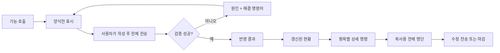

# K-LOL.GG 카카오톡 구인 기능 UX 통합 설계안

- 문서 상태: 파티·내전·스크림 응답 UX 및 파티 `DRAFT` 상태 소스 반영
- 작성일: 2026-08-23
- 대상: 파티 구인, 내전 구인, 멸망전 스크림 구인
- 구현 상태: 파티 양식·반영·현황·상세, 내전·스크림 상세 동선, 파티 `DRAFT` 마이그레이션 소스 반영. 커밋·운영 배포는 미반영

## 상태 기록

- 2026-08-23: 파티 양식 응답에서 현황을 제거하고, 반영 성공 시 최신 전체 명단과 요약 현황을 표시하도록 소스 반영
- 2026-08-23: 파티 현황을 구인 수와 무관한 요약형으로 통일하고 모든 항목에 `상세 번호` CTA를 추가
- 2026-08-23: 파티 상세 응답에 최신 복사용 명단, 수정 안내, 마감 명령을 추가

## 1. 목적

카카오톡 구인 기능마다 다른 명령어와 응답 구조를 다음 공통 흐름으로 통일한다.

```text
기능 호출 → 양식 작성 → 반영 → 현황 확인 → 상세 확인 → 수정/마감
```

사용자가 과거 메시지를 위로 찾아가거나 긴 도움말을 외우지 않아도, 현재 응답만 보고 다음 행동을 결정할 수 있어야 한다.

## 2. 핵심 문제

### 확인됨

- 파티 `구인현황`의 상세 조회 안내는 전체 목록 맨 아래에만 표시된다.
- 파티 현황은 진행 중 구인이 5개 이하면 전체 명단, 6개 이상이면 요약 명단으로 바뀐다.
- 파티 상세 명령은 `상세 3`, `구인상세 3`을 지원한다.
- 내전 상세는 현재 `내전현황 3` 형태이고, 스크림은 `스크림상세 3`을 지원한다.
- 파티 양식 생성 API는 모집번호 확보를 위해 빈 파티를 즉시 `IN_PROGRESS`로 저장한다.
- 현재 파티 구인 API 응답은 일반 텍스트 중심이며 빠른응답 버튼을 제공하지 않는다.

### 추정

- 사용자는 목록을 읽는 시점에 상세 명령을 발견하지 못해 이전 전체 양식을 위로 찾아간다.
- 구인 수에 따라 현황 형식이 달라져 사용자가 상세 명령이 필요한 상황을 예측하기 어렵다.
- `양식 호출`과 `실제 반영`이 데이터 상태에서 구분되지 않아 빈 구인글이 현황에 노출될 수 있다.

## 3. 용어 표준

| 용어 | 의미 | 데이터 변경 |
| --- | --- | --- |
| 양식 | 사용자가 작성할 빈 입력 양식 | 목표 상태에서는 없음 또는 `DRAFT`만 생성 |
| 반영 | 작성된 양식을 검증하고 현재 상태로 확정 | 있음 |
| 현황 | 여러 구인의 읽기 전용 요약 | 없음 |
| 상세 | 구인 한 건의 최신 복사용 전체 명단 | 없음 |
| 수정 | 상세 양식을 편집해 다시 전송 | 있음 |
| 마감 | 진행 중 구인을 종료 | 있음 |

응답에서 `생성`, `등록`, `업데이트`, `반영`을 혼용하지 않는다. 사용자에게는 쓰기 성공을 모두 `반영`으로 표시하고, 내부 로그에서만 CREATE/UPDATE를 구분한다.

## 4. 공통 사용자 흐름



### 공통 응답 순서

1. `[K-LOL.GG 기능명 상태]`
2. 처리 결과 한 줄
3. 사용자가 방금 변경한 대상
4. 다음 행동 한 줄
5. 필요한 경우에만 현재 현황

하나의 응답에 장문의 도움말과 현황을 동시에 반복하지 않는다.

## 5. 명령어 표준

| 행동 | 파티 | 내전 | 스크림 |
| --- | --- | --- | --- |
| 시작 | `5인파티` 등 기존 인원 명령 | `내전구인` | `스크림구인` |
| 종목 선택 | 양식에서 선택 | `내전구인 협곡` 등 | 양식에서 입력 |
| 현황 | `구인현황` | `내전현황` | `스크림현황` |
| 상세 | `상세 3` | `내전상세 3` | `스크림상세 3` |
| 기존 별칭 | `구인상세 3` | `내전현황 3` | 기존 스크림 별칭 |
| 마감 | `3ㅉ` | 오전 6시 자동 종료 유지 | 기존 확정·취소·완료 명령 유지 |

규 표준 명령을 추가하되 기존 명령은 호환 별칭으로 유지한다. 사용자가 보는 안내에는 가장 짧은 표준 명령 하나만 노출한다.

허용 편의 입력:
신
- `상세3`, `상세 #3`, `/상세 3`
- `내전상세3`, `내전상세 #3`
- `스크림상세3`, `스크림상세 #3`

`3`, `#3`만 입력하는 방식은 다른 카카오 기능과 충돌할 수 있어 사용하지 않는다.

## 6. 응답 설계

### 6.1 양식 응답

양식 응답에는 구인현황을 붙이지 않는다.

```text
[K-LOL.GG 구인구직 양식]
아래 양식에 이름을 작성한 뒤 메시지 전체를 보내주세요.

모집번호: #3
1.
2.
3.
4.
5.
```

규칙:

- 현재 현황과 다른 구인글을 표시하지 않는다.
- 작성 방법은 한 줄만 표시한다.
- 모집번호, 운영일 등 반영에 필요한 식별자는 사용자가 삭제하지 않도록 안내한다.
- 같은 요청이 재전송돼도 동일한 양식만 반환한다.

### 6.2 반영 성공 응답

반영 성공 시 방금 변경된 구인의 전체 명단과 전체 현황 요약을 순서대로 표시한다.

```text
[파티 #3 반영]
3/5 · 예비 0명

[현재 구인현황]
#3 · 5인 파티 · 3/5 · 지금 · 증바
└ 전체 명단: 상세 3
#4 · 10인 파티 · 7/10 · 21:00 · 협곡
└ 전체 명단: 상세 4
```

규칙:

- 반영 성공 응답에만 현황을 자동으로 붙인다.
- 반영 실패 응답에는 현황을 붙이지 않는다.
- 방금 수정한 구인은 전체 명단으로 먼저 보여줘 이전 메시지를 찾지 않게 한다.
- 전체 현황은 항상 요약형으로 유지한다.

### 6.3 현황 응답

구인 수와 관계없이 같은 요약 구조를 사용한다.

```text
[K-LOL.GG 구인구직 현황]
🔎 전체 명단: /구인현황

#3 · 5인 파티 · 3/5 · 지금 · 증바
참여: 재현, 근열, 다예
└ 상세 3

#4 · 10인 파티 · 7/10 · 21:00 · 협곡
참여: 정우, 정민, 범찬 외 4명
└ 상세 4
```

규칙:

- 상세 안내는 목록 상단에 한 줄, 각 항목 아래에 실제 번호를 포함해 표시한다.
- 목록 맨 아래의 장문 상세 설명은 제거한다.
- 구인 수에 따라 전체형/요약형을 전환하지 않는다.
- 메시지 길이 제한을 넘으면 우선순위가 낮은 종료 임박·진행 중 항목을 다음 페이지로 분리한다.

### 6.4 상세 응답

상세 응답은 조회용이면서 그대로 복사해 수정할 수 있는 최신 양식이어야 한다.

```text
[K-LOL.GG 구인상세 #3]
5인 파티 · 3/5 · 지금 · 증바

모집번호: #3
1. 재현
2. 근열
3. 다예
4.
5.
예비 1.
```

규칙:

- DB의 최신 상태만 사용한다.
- 과거 원본 메시지를 그대로 재사용하지 않는다.
- 수정과 마감의 다음 행동을 응답 마지막에 표시한다.
- 마감된 번호는 수정 양식 대신 마감 상태와 새 양식 호출법을 표시한다.

### 6.5 오류 응답

오류는 `원인 → 해결 행동 → 예시` 세 부분만 표시한다.

```text
[K-LOL.GG 구인 반영 실패]
모집번호 #3을 찾지 못했습니다.

해결: 최신 명단을 다시 불러와주세요.
👉 상세 3
```

금지 사항:

- 내부 API 경로나 서버 예외를 사용자 메시지에 표시하지 않는다.
- 여러 해결법을 한 번에 나열하지 않는다.
- 실패 응답 뒤에 전체 현황을 자동으로 붙이지 않는다.

## 7. 기능별 적용

### 7.1 파티 구인

- 양식: `party-recruits/create`
- 반영: `party-recruits/sync`
- 현황·상세: `party-recruits/status`
- 마감: `party-recruits/finish`

적용 항목:

1. 양식 응답에서 현황 제거
2. 반영 직후 변경된 파티 전체 명단 표시
3. 현황을 항상 요약형으로 통일
4. 모든 요약 항목에 `상세 번호` 표시
5. 상세 응답을 복사용 최신 양식으로 통일

### 7.2 내전 구인

- 양식·현황: `recruit/season-apply/status`
- 반영: `recruit/season-apply`

적용 항목:

1. 종목 선택 응답과 양식 응답을 분리
2. 반영 결과에 등록/대기/예비/취소 수를 한 줄로 요약
3. 현황의 각 내전에 `내전상세 번호` 표시
4. 기존 `내전현황 번호`는 호환 별칭으로 유지
5. 협곡/칼바람/증바람의 명단 필드 차이는 유지

### 7.3 스크림 구인

- 양식·반영: `destruction-scrim-recruits/create`
- 현황·상세: `destruction-scrim-recruits/status`
- 참가·확정·취소·마감은 기존 개별 API 유지

적용 항목:

1. 빈 양식과 등록 결과를 명확히 분리
2. 스크림 현황 각 항목에 `스크림상세 번호` 표시
3. 상세 응답에 우리팀·상대팀 최신 라인업과 가능한 다음 행동 표시
4. 참가/확정/취소 성공 후 갱신된 스크림 요약 표시

## 8. 데이터 상태 설계

### 8.1 초기 적용안: DB 변경 없음

- 기존 파티 번호 자동 배정과 `IN_PROGRESS` 생성을 유지한다.
- 양식 응답에서 현황만 제거한다.
- 빈 파티가 현황에 보일 가능성은 남는다.

장점: 마이그레이션 없이 빠르게 적용 가능.

위험: 사용자가 양식을 호출하고 제출하지 않아도 빈 구인글이 진행 중으로 남을 수 있다.

### 8.2 목표 상태: `DRAFT → IN_PROGRESS`

`RecruitPartyStatus`에 `DRAFT`를 추가한다.

```text
양식 호출 → DRAFT 번호 예약
정상 양식 반영 → IN_PROGRESS 전환
10~15분 미반영 → DRAFT 자동 만료
현황 조회 → DRAFT 제외
```

권장 규칙:

- `DRAFT`는 요청자·방·요청키가 같은 경우 재사용한다.
- `DRAFT`는 일반 구인현황, 디스코드 모니터, 참여 인원 통계에서 제외한다.
- 첫 정상 반영 시에만 생성 로그와 운영 알림을 남긴다.
- 마이그레이션 전 기존 `IN_PROGRESS` 행은 그대로 유지한다.

이 목표 상태가 `양식은 미반영, 제출 후 현황 노출`이라는 사용자 인식과 가장 정확히 일치한다.

## 9. 빠른응답 버튼

1차 버전은 텍스트 명령으로 구현한다. 현재 파티 API는 카카오 Skill v2의 `quickReplies` 구조를 사용하지 않기 때문이다.

추후 카카오봇 연동 방식이 버튼 응답을 지원하면 다음 버튼을 제공한다.

- `#3 상세`
- `#4 상세`
- `현황 새로고침`
- `구인 마감`

버튼 적용 전에는 실제 카카오봇 스크립트가 추가 JSON 필드를 보존하는지 확인해야 한다.

## 10. 로깅과 지표

요청 본문이나 전체 명단은 로그에 저장하지 않고 다음 이벤트만 집계한다.

| 이벤트 | 목적 |
| --- | --- |
| `KAKAO_RECRUIT_TEMPLATE_VIEW` | 양식 호출 수 |
| `KAKAO_RECRUIT_APPLY_SUCCESS` | 정상 반영 수 |
| `KAKAO_RECRUIT_APPLY_FAILURE` | 반영 실패율 |
| `KAKAO_RECRUIT_STATUS_VIEW` | 현황 조회 수 |
| `KAKAO_RECRUIT_DETAIL_VIEW` | 상세 명령 사용 수 |
| `KAKAO_RECRUIT_STALE_FORM_REJECTED` | 과거 양식 재사용 차단 수 |

주요 판단 지표:

- `상세 조회 수 / 현황 조회 수`
- `반영 성공 수 / 양식 호출 수`
- 잘못된 전체 현황 복사 반영 시도 수
- 양식 호출 후 미반영 `DRAFT` 만료율

## 11. 테스트 기준

### 공통 계약 테스트

- 양식 응답에 `[현재 ...현황]`이 포함되지 않는다.
- 반영 성공 응답에는 반영 결과와 현황이 포함된다.
- 반영 실패 응답에는 현황이 포함되지 않는다.
- 현황의 모든 항목에 해당 번호의 상세 명령이 포함된다.
- 상세 응답은 다시 반영 가능한 최신 전체 양식이다.
- 기존 명령 별칭이 계속 동작한다.

### 필수 시나리오

1. 빈 양식 호출
2. 첫 반영
3. 동일 요청 재전송
4. 인원 추가·삭제
5. 예비 인원 승격
6. 여러 구인이 동시에 존재하는 현황
7. 존재하지 않는 번호 상세 조회
8. 마감된 번호 수정 시도
9. 오전 6시 운영일 전환
10. 메시지 최대 길이 근접 현황

## 12. 배포 단계

### 1차: 응답 UX 정리

- 양식/반영/현황/상세 응답 계약 적용
- 파티 구인부터 적용
- 기능 플래그 `recruitUxV2Enabled`로 구형 응답 복귀 가능하게 구성

### 2차: 내전·스크림 통일

- 동일한 문구와 상세 CTA 적용
- 기존 별칭 회귀 테스트 추가

### 3차: 데이터 상태 정리

- `DRAFT` 상태 마이그레이션
- 초안 자동 만료와 현황 필터 적용

### 4차: 운영 검증

- 일주일간 상세 조회율과 반영 실패율 모니터링
- 사용자 안내 문구가 계속 무시되면 빠른응답 버튼 검토

## 13. 완료 조건

- 사용자가 과거 메시지를 찾지 않고 현재 현황에서 상세 명단을 불러올 수 있다.
- 세 구인 기능의 응답 순서와 용어가 동일하다.
- 양식만 호출한 상태와 실제 반영된 상태가 구분된다.
- 오류 메시지에 사용자가 바로 실행할 명령어가 하나 포함된다.
- 자동 테스트, 빌드, 테스트 DB API 시나리오가 모두 통과한다.
- 운영 반영 후 카카오 로그에서 5xx 증가와 잘못된 라우팅이 없다.

## 14. 결정이 필요한 항목

구현 전에 아래 두 항목을 확정한다.

1. 파티 양식 호출 시 빈 파티를 즉시 `IN_PROGRESS`로 유지할지, `DRAFT`를 도입할지
2. 반영 성공 응답에 `방금 수정한 전체 명단 + 전체 현황 요약`을 모두 표시할지, 전체 명단만 표시할지

권장안은 `1차 응답 UX 적용 → 3차 DRAFT 도입`, 반영 성공 응답은 `방금 수정한 전체 명단 + 전체 현황 요약`이다.
