<!-- GENERATED FILE. DO NOT EDIT DIRECTLY. -->

# Drizzle ERD

이 문서는 `src/platform/db/schema/*.ts`의 Drizzle 메타데이터만 읽어 생성합니다.
운영 DB, 환경 변수, 외부 서비스에는 연결하지 않습니다.

- Source: `src/platform/db/schema/index.ts`
- Schema SHA-256: `55b03fc0f6b0797963b240fc723ebee2cb8b5c6187e43996a1d6eafbd3d04cd0`
- Tables: 101
- Foreign keys: 163
- Regenerate: `npm run db:erd`
- Drift check: `npm run db:erd:check`

엔터티 이름의 `__` 앞부분은 PostgreSQL schema입니다. 예: `auth__user_accounts`는
`auth.user_accounts`를 뜻합니다. 다른 schema의 부모 테이블은 해당 섹션에 관계용 엔터티로
표시될 수 있으며, 전체 컬럼은 그 테이블의 schema 섹션에서 확인합니다.

## assets

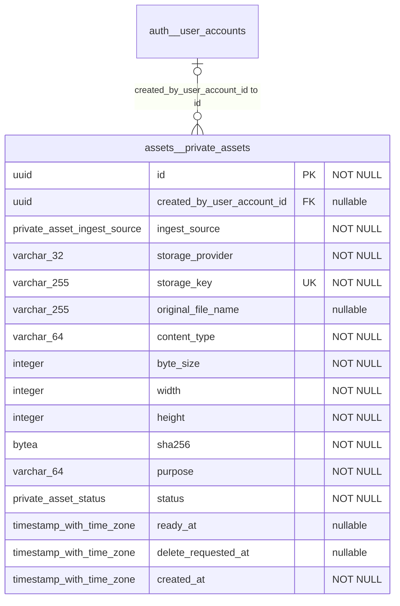

## audit

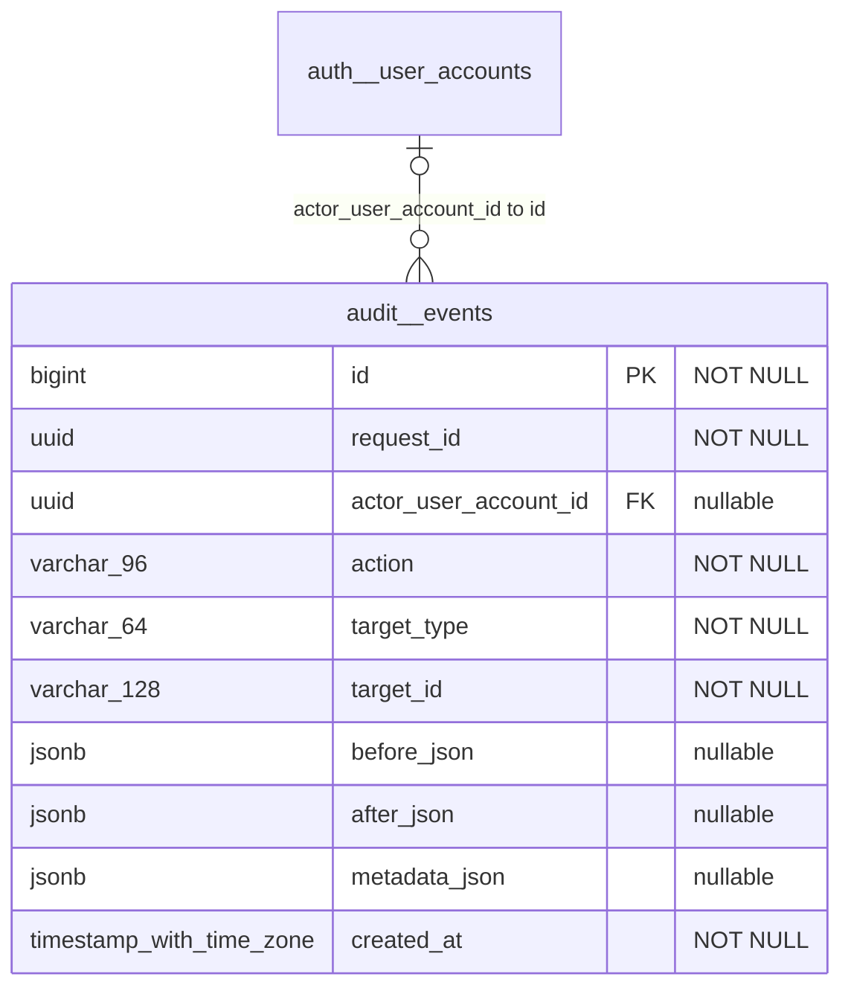

## auth

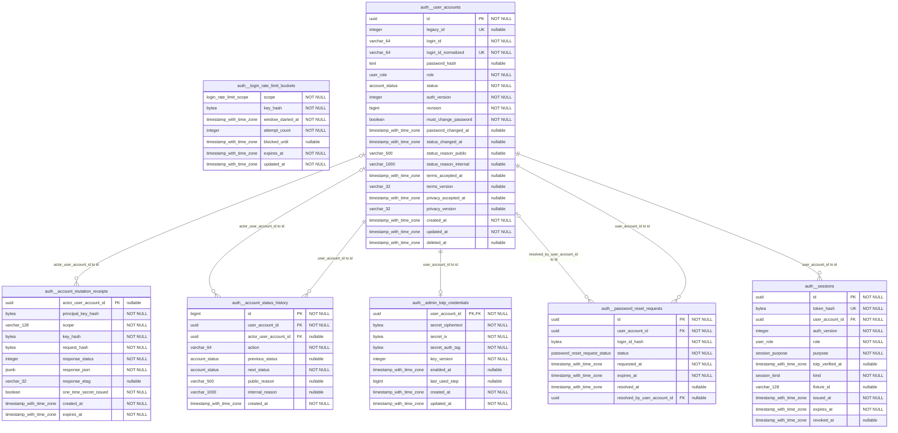

## catalog

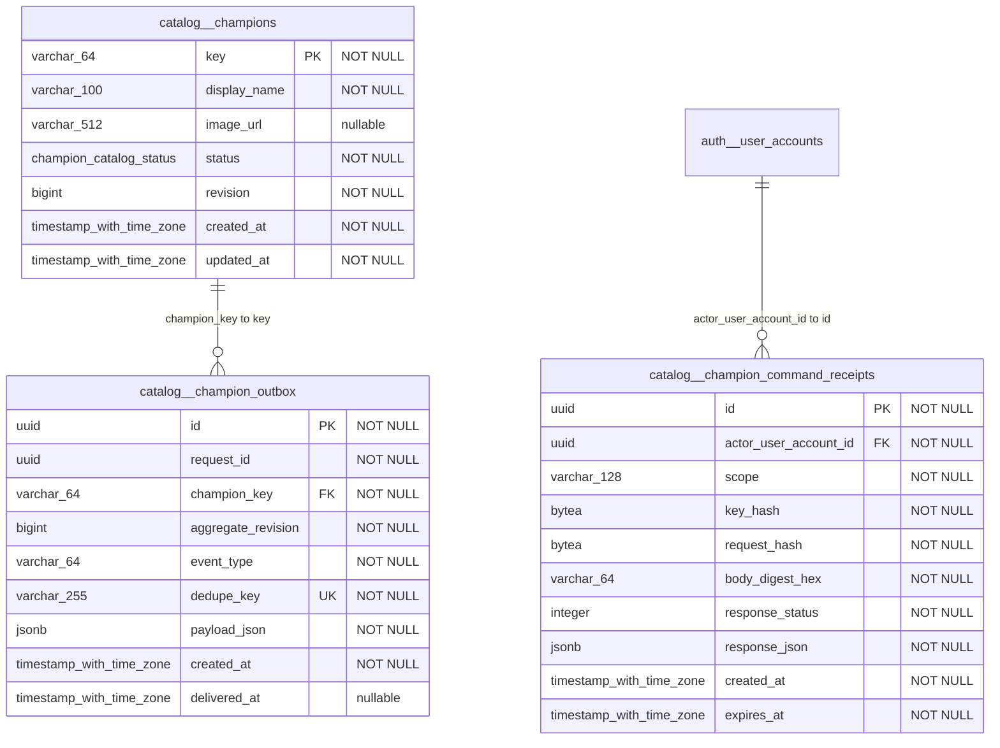

## competition

```mermaid
erDiagram
    competition__destruction_application_index {
        uuid tournament_id PK, FK "NOT NULL"
        uuid application_id PK "NOT NULL"
        uuid owner_user_account_id FK "NOT NULL"
        uuid player_id FK "NOT NULL"
        destruction_position position "NOT NULL"
        destruction_application_status status "NOT NULL"
        timestamp_with_time_zone updated_at "NOT NULL"
    }
    competition__destruction_command_receipts {
        uuid id PK "NOT NULL"
        uuid tournament_id FK "NOT NULL"
        uuid actor_user_account_id FK "NOT NULL"
        varchar_128 scope "NOT NULL"
        bytea key_hash "NOT NULL"
        bytea request_hash "NOT NULL"
        integer response_status "NOT NULL"
        jsonb response_json "NOT NULL"
        bigint revision "NOT NULL"
        timestamp_with_time_zone created_at "NOT NULL"
        timestamp_with_time_zone expires_at "NOT NULL"
    }
    competition__destruction_competitions {
        uuid id PK "NOT NULL"
        varchar_120 title "NOT NULL"
        varchar_120 title_normalized "NOT NULL"
        destruction_competition_status status "NOT NULL"
        destruction_preliminary_format preliminary_format "NOT NULL"
        integer team_count "NOT NULL"
        integer participant_count "NOT NULL"
        uuid gallery_id FK "nullable"
        jsonb aggregate_json "NOT NULL"
        bigint revision "NOT NULL"
        uuid created_by_user_account_id FK "NOT NULL"
        uuid updated_by_user_account_id FK "NOT NULL"
        timestamp_with_time_zone created_at "NOT NULL"
        timestamp_with_time_zone updated_at "NOT NULL"
    }
    competition__destruction_outbox {
        varchar_180 id PK "NOT NULL"
        uuid request_id UK "NOT NULL"
        uuid tournament_id FK "NOT NULL"
        bigint aggregate_revision "NOT NULL"
        varchar_64 event_type "NOT NULL"
        varchar_255 dedupe_key UK "NOT NULL"
        jsonb payload_json "NOT NULL"
        destruction_outbox_status status "NOT NULL"
        integer attempt_count "NOT NULL"
        timestamp_with_time_zone created_at "NOT NULL"
        timestamp_with_time_zone delivered_at "nullable"
    }
    competition__event_command_receipts {
        uuid id PK "NOT NULL"
        uuid event_id FK "NOT NULL"
        uuid actor_user_account_id FK "NOT NULL"
        varchar_128 scope "NOT NULL"
        bytea key_hash "NOT NULL"
        bytea request_hash "NOT NULL"
        integer response_status "NOT NULL"
        jsonb response_json "NOT NULL"
        bigint revision "NOT NULL"
        timestamp_with_time_zone created_at "NOT NULL"
        timestamp_with_time_zone expires_at "NOT NULL"
    }
    competition__event_competitions {
        uuid id PK "NOT NULL"
        varchar_120 title "NOT NULL"
        varchar_120 title_normalized "NOT NULL"
        varchar_2000 description "nullable"
        event_competition_format format "NOT NULL"
        event_competition_status status "NOT NULL"
        timestamp_with_time_zone recruitment_opens_at "NOT NULL"
        timestamp_with_time_zone recruitment_closes_at "NOT NULL"
        integer bracket_best_of "NOT NULL"
        integer active_participant_count "NOT NULL"
        uuid gallery_id FK "nullable"
        jsonb aggregate_json "NOT NULL"
        bigint revision "NOT NULL"
        uuid created_by_user_account_id FK "NOT NULL"
        uuid updated_by_user_account_id FK "NOT NULL"
        timestamp_with_time_zone created_at "NOT NULL"
        timestamp_with_time_zone updated_at "NOT NULL"
    }
    competition__event_outbox {
        varchar_180 id PK "NOT NULL"
        uuid request_id UK "NOT NULL"
        uuid event_id FK "NOT NULL"
        bigint aggregate_revision "NOT NULL"
        varchar_64 event_type "NOT NULL"
        varchar_255 dedupe_key UK "NOT NULL"
        jsonb payload_json "NOT NULL"
        event_outbox_status status "NOT NULL"
        integer attempt_count "NOT NULL"
        timestamp_with_time_zone created_at "NOT NULL"
        timestamp_with_time_zone delivered_at "nullable"
    }
    competition__event_participant_index {
        uuid event_id PK, FK "NOT NULL"
        varchar_180 participant_id PK "NOT NULL"
        uuid player_id FK "NOT NULL"
        uuid owner_user_account_id FK "nullable"
        event_participant_source source "NOT NULL"
        event_participant_status status "NOT NULL"
        varchar_3 main_position "nullable"
        jsonb sub_positions_json "NOT NULL"
        timestamp_with_time_zone updated_at "NOT NULL"
    }
    competition__match_aggregate_versions {
        uuid id PK "NOT NULL"
        uuid match_series_id FK "NOT NULL"
        bigint revision "NOT NULL"
        jsonb snapshot_json "NOT NULL"
        bytea input_digest "NOT NULL"
        uuid archived_by_user_account_id FK "nullable"
        timestamp_with_time_zone archived_at "NOT NULL"
    }
    competition__match_command_receipts {
        uuid id PK "NOT NULL"
        uuid actor_user_account_id FK "NOT NULL"
        varchar_96 scope "NOT NULL"
        bytea key_hash "NOT NULL"
        bytea request_hash "NOT NULL"
        integer response_status "NOT NULL"
        jsonb response_json "NOT NULL"
        varchar_32 response_etag "nullable"
        uuid target_id "nullable"
        timestamp_with_time_zone created_at "NOT NULL"
        timestamp_with_time_zone expires_at "NOT NULL"
    }
    competition__match_games {
        uuid id PK "NOT NULL"
        uuid series_id FK "NOT NULL"
        integer game_number "NOT NULL"
        integer duration_seconds "NOT NULL"
        match_team winner_team "NOT NULL"
        uuid mvp_player_id FK "NOT NULL"
        integer mvp_score_units_2 "NOT NULL"
        varchar_32 mvp_formula_version "NOT NULL"
        varchar_64 mvp_selection "NOT NULL"
        bigint revision "NOT NULL"
        timestamp_with_time_zone created_at "NOT NULL"
        timestamp_with_time_zone updated_at "NOT NULL"
    }
    competition__match_ocr_reservations {
        uuid id PK "NOT NULL"
        uuid actor_user_account_id FK "NOT NULL"
        uuid submission_id FK "NOT NULL"
        uuid image_id FK "NOT NULL"
        varchar_96 scope "NOT NULL"
        bytea key_hash "NOT NULL"
        bytea request_hash "NOT NULL"
        bigint expected_revision "NOT NULL"
        match_ocr_reservation_status status "NOT NULL"
        timestamp_with_time_zone expires_at "NOT NULL"
        timestamp_with_time_zone finalized_at "nullable"
        timestamp_with_time_zone failed_at "nullable"
        varchar_64 failure_code "nullable"
        timestamp_with_time_zone created_at "NOT NULL"
        timestamp_with_time_zone updated_at "NOT NULL"
    }
    competition__match_participants {
        uuid id PK "NOT NULL"
        uuid game_id FK "NOT NULL"
        uuid player_id FK "NOT NULL"
        varchar_64 nickname_snapshot "NOT NULL"
        varchar_32 tag_line_snapshot "NOT NULL"
        varchar_64 champion_key FK "NOT NULL"
        match_team team "NOT NULL"
        match_position position "NOT NULL"
        integer kills "NOT NULL"
        integer deaths "NOT NULL"
        integer assists "NOT NULL"
        integer mvp_score_units_2 "NOT NULL"
        varchar_32 mvp_formula_version "NOT NULL"
        timestamp_with_time_zone created_at "NOT NULL"
        timestamp_with_time_zone updated_at "NOT NULL"
    }
    competition__match_rate_limit_buckets {
        match_rate_limit_scope scope "NOT NULL"
        bytea key_hash "NOT NULL"
        timestamp_with_time_zone window_started_at "NOT NULL"
        integer attempt_count "NOT NULL"
        timestamp_with_time_zone blocked_until "nullable"
        timestamp_with_time_zone expires_at "NOT NULL"
        timestamp_with_time_zone updated_at "NOT NULL"
    }
    competition__match_recalculation_outbox {
        uuid id PK "NOT NULL"
        varchar_64 aggregate_type "NOT NULL"
        uuid aggregate_id "NOT NULL"
        varchar_64 event_type "NOT NULL"
        varchar_32 action "NOT NULL"
        varchar_160 dedupe_key UK "NOT NULL"
        bigint match_revision "NOT NULL"
        uuid team_balance_draft_id "nullable"
        uuid old_season_id FK "nullable"
        uuid new_season_id FK "nullable"
        varchar_255 old_order_key "nullable"
        varchar_255 new_order_key "nullable"
        bytea input_digest "NOT NULL"
        jsonb payload_json "NOT NULL"
        match_outbox_status status "NOT NULL"
        integer attempt_count "NOT NULL"
        timestamp_with_time_zone available_at "NOT NULL"
        timestamp_with_time_zone locked_at "nullable"
        timestamp_with_time_zone delivered_at "nullable"
        varchar_64 last_error_code "nullable"
        timestamp_with_time_zone created_at "NOT NULL"
        timestamp_with_time_zone updated_at "NOT NULL"
    }
    competition__match_series {
        uuid id PK "NOT NULL"
        bigint legacy_id UK "nullable"
        uuid season_id FK "NOT NULL"
        uuid team_balance_draft_id FK "nullable"
        varchar_160 title "NOT NULL"
        varchar_160 title_normalized "NOT NULL"
        date played_on "NOT NULL"
        timestamp_with_time_zone started_at "nullable"
        integer started_at_offset_minutes "nullable"
        integer blue_wins "NOT NULL"
        integer red_wins "NOT NULL"
        integer game_count "NOT NULL"
        match_series_status status "NOT NULL"
        text void_reason "nullable"
        timestamp_with_time_zone voided_at "nullable"
        bigint revision "NOT NULL"
        uuid created_by_user_account_id FK "nullable"
        uuid updated_by_user_account_id FK "nullable"
        timestamp_with_time_zone published_at "nullable"
        timestamp_with_time_zone created_at "NOT NULL"
        timestamp_with_time_zone updated_at "NOT NULL"
    }
    competition__match_submission_images {
        uuid id PK "NOT NULL"
        uuid submission_id FK "NOT NULL"
        uuid private_asset_id FK, UK "NOT NULL"
        integer game_number "NOT NULL"
        match_submission_image_ocr_status ocr_status "NOT NULL"
        jsonb ocr_candidate_json "nullable"
        varchar_64 ocr_error_code "nullable"
        bigint revision "NOT NULL"
        timestamp_with_time_zone created_at "NOT NULL"
        timestamp_with_time_zone updated_at "NOT NULL"
    }
    competition__match_submissions {
        uuid id PK "NOT NULL"
        bigint legacy_id UK "nullable"
        varchar_24 public_code UK "NOT NULL"
        uuid owner_user_account_id FK "nullable"
        uuid season_id FK "nullable"
        varchar_160 title "NOT NULL"
        varchar_100 organizer "NOT NULL"
        integer series_number "NOT NULL"
        text note "nullable"
        date played_on "NOT NULL"
        timestamp_with_time_zone started_at "nullable"
        integer started_at_offset_minutes "nullable"
        integer expected_game_count "NOT NULL"
        uuid team_balance_draft_id "nullable"
        match_submission_source source "NOT NULL"
        bytea source_reference_hash "NOT NULL"
        jsonb provenance_json "nullable"
        jsonb reviewed_result_json "nullable"
        match_submission_status status "NOT NULL"
        text public_review_reason "nullable"
        uuid reviewed_by_user_account_id FK "nullable"
        timestamp_with_time_zone reviewed_at "nullable"
        timestamp_with_time_zone cancelled_at "nullable"
        uuid approved_match_series_id FK, UK "nullable"
        bigint revision "NOT NULL"
        timestamp_with_time_zone created_at "NOT NULL"
        timestamp_with_time_zone updated_at "NOT NULL"
    }
    competition__match_upload_reservations {
        uuid id PK "NOT NULL"
        uuid actor_user_account_id FK "NOT NULL"
        uuid submission_id FK "NOT NULL"
        varchar_96 scope "NOT NULL"
        bytea key_hash "NOT NULL"
        bytea request_hash "NOT NULL"
        integer game_number "NOT NULL"
        bigint expected_revision "NOT NULL"
        varchar_64 declared_content_type "NOT NULL"
        integer declared_byte_size "NOT NULL"
        bytea declared_sha256 "NOT NULL"
        varchar_32 storage_provider "NOT NULL"
        varchar_255 storage_key UK "NOT NULL"
        match_upload_reservation_status status "NOT NULL"
        timestamp_with_time_zone expires_at "NOT NULL"
        timestamp_with_time_zone staged_at "nullable"
        timestamp_with_time_zone finalized_at "nullable"
        timestamp_with_time_zone delete_requested_at "nullable"
        varchar_64 delete_failure_code "nullable"
        timestamp_with_time_zone storage_deleted_at "nullable"
        timestamp_with_time_zone cancelled_at "nullable"
        timestamp_with_time_zone created_at "NOT NULL"
        timestamp_with_time_zone updated_at "NOT NULL"
    }
    competition__season_applications {
        uuid id PK "NOT NULL"
        bigint legacy_id UK "nullable"
        uuid season_id FK "NOT NULL"
        uuid player_id FK "NOT NULL"
        date apply_date "NOT NULL"
        integer recruit_no "NOT NULL"
        integer source_slot_no "nullable"
        season_application_position main_position "NOT NULL"
        season_application_position_array sub_positions "NOT NULL"
        season_application_status status "NOT NULL"
        season_application_source source "NOT NULL"
        bytea source_reference_hash "nullable"
        bytea source_room_id_hash "nullable"
        varchar_16 source_mode "nullable"
        text review_note "nullable"
        uuid reviewed_by_user_account_id FK "nullable"
        timestamp_with_time_zone reviewed_at "nullable"
        timestamp_with_time_zone cancelled_at "nullable"
        bigint revision "NOT NULL"
        timestamp_with_time_zone created_at "NOT NULL"
        timestamp_with_time_zone updated_at "NOT NULL"
    }
    competition__season_command_receipts {
        uuid id PK "NOT NULL"
        uuid actor_user_account_id FK "NOT NULL"
        varchar_96 scope "NOT NULL"
        bytea key_hash "NOT NULL"
        bytea request_hash "NOT NULL"
        integer response_status "NOT NULL"
        jsonb response_json "NOT NULL"
        uuid target_id "nullable"
        timestamp_with_time_zone created_at "NOT NULL"
        timestamp_with_time_zone expires_at "NOT NULL"
    }
    competition__season_kakao_pending_applications {
        uuid id PK "NOT NULL"
        uuid season_id FK "NOT NULL"
        uuid matched_player_id FK "nullable"
        date apply_date "NOT NULL"
        integer recruit_no "NOT NULL"
        integer slot_no "NOT NULL"
        varchar_100 supplied_name "NOT NULL"
        varchar_97 supplied_riot_id "nullable"
        season_application_position main_position "NOT NULL"
        season_application_position_array sub_positions "NOT NULL"
        boolean reserve "NOT NULL"
        season_kakao_pending_match_state match_state "NOT NULL"
        season_kakao_pending_status status "NOT NULL"
        bytea source_reference_hash "NOT NULL"
        bytea source_room_id_hash "nullable"
        varchar_16 source_mode "nullable"
        timestamp_with_time_zone cancelled_at "nullable"
        timestamp_with_time_zone resolved_at "nullable"
        bigint revision "NOT NULL"
        timestamp_with_time_zone created_at "NOT NULL"
        timestamp_with_time_zone updated_at "NOT NULL"
    }
    competition__seasons {
        uuid id PK "NOT NULL"
        bigint legacy_id UK "nullable"
        varchar_120 name "NOT NULL"
        varchar_120 name_normalized UK "NOT NULL"
        season_status status "NOT NULL"
        timestamp_with_time_zone applications_open_at "nullable"
        timestamp_with_time_zone applications_close_at "nullable"
        timestamp_with_time_zone starts_at "nullable"
        timestamp_with_time_zone ends_at "nullable"
        uuid cloned_from_season_id FK "nullable"
        bigint revision "NOT NULL"
        uuid created_by_user_account_id FK "nullable"
        uuid updated_by_user_account_id FK "nullable"
        timestamp_with_time_zone activated_at "nullable"
        timestamp_with_time_zone ended_at "nullable"
        timestamp_with_time_zone retired_at "nullable"
        timestamp_with_time_zone created_at "NOT NULL"
        timestamp_with_time_zone updated_at "NOT NULL"
    }
    assets__private_assets ||--o| competition__match_submission_images : "private_asset_id to id"
    auth__user_accounts ||--o{ competition__destruction_application_index : "owner_user_account_id to id"
    auth__user_accounts ||--o{ competition__destruction_command_receipts : "actor_user_account_id to id"
    auth__user_accounts ||--o{ competition__destruction_competitions : "created_by_user_account_id to id"
    auth__user_accounts ||--o{ competition__destruction_competitions : "updated_by_user_account_id to id"
    auth__user_accounts ||--o{ competition__event_command_receipts : "actor_user_account_id to id"
    auth__user_accounts ||--o{ competition__event_competitions : "created_by_user_account_id to id"
    auth__user_accounts ||--o{ competition__event_competitions : "updated_by_user_account_id to id"
    auth__user_accounts o|--o{ competition__event_participant_index : "owner_user_account_id to id"
    auth__user_accounts o|--o{ competition__match_aggregate_versions : "archived_by_user_account_id to id"
    auth__user_accounts ||--o{ competition__match_command_receipts : "actor_user_account_id to id"
    auth__user_accounts ||--o{ competition__match_ocr_reservations : "actor_user_account_id to id"
    auth__user_accounts o|--o{ competition__match_series : "created_by_user_account_id to id"
    auth__user_accounts o|--o{ competition__match_series : "updated_by_user_account_id to id"
    auth__user_accounts o|--o{ competition__match_submissions : "owner_user_account_id to id"
    auth__user_accounts o|--o{ competition__match_submissions : "reviewed_by_user_account_id to id"
    auth__user_accounts ||--o{ competition__match_upload_reservations : "actor_user_account_id to id"
    auth__user_accounts o|--o{ competition__season_applications : "reviewed_by_user_account_id to id"
    auth__user_accounts ||--o{ competition__season_command_receipts : "actor_user_account_id to id"
    auth__user_accounts o|--o{ competition__seasons : "created_by_user_account_id to id"
    auth__user_accounts o|--o{ competition__seasons : "updated_by_user_account_id to id"
    catalog__champions ||--o{ competition__match_participants : "champion_key to key"
    competition__destruction_competitions ||--o{ competition__destruction_application_index : "tournament_id to id"
    competition__destruction_competitions ||--o{ competition__destruction_command_receipts : "tournament_id to id"
    competition__destruction_competitions ||--o{ competition__destruction_outbox : "tournament_id to id"
    competition__event_competitions ||--o{ competition__event_command_receipts : "event_id to id"
    competition__event_competitions ||--o{ competition__event_outbox : "event_id to id"
    competition__event_competitions ||--o{ competition__event_participant_index : "event_id to id"
    competition__match_games ||--o{ competition__match_participants : "game_id to id"
    competition__match_series ||--o{ competition__match_aggregate_versions : "match_series_id to id"
    competition__match_series ||--o{ competition__match_games : "series_id to id"
    competition__match_series o|--o| competition__match_submissions : "approved_match_series_id to id"
    competition__match_submission_images ||--o{ competition__match_ocr_reservations : "image_id to id"
    competition__match_submissions ||--o{ competition__match_ocr_reservations : "submission_id to id"
    competition__match_submissions ||--o{ competition__match_submission_images : "submission_id to id"
    competition__match_submissions ||--o{ competition__match_upload_reservations : "submission_id to id"
    competition__seasons o|--o{ competition__match_recalculation_outbox : "new_season_id to id"
    competition__seasons o|--o{ competition__match_recalculation_outbox : "old_season_id to id"
    competition__seasons ||--o{ competition__match_series : "season_id to id"
    competition__seasons o|--o{ competition__match_submissions : "season_id to id"
    competition__seasons ||--o{ competition__season_applications : "season_id to id"
    competition__seasons ||--o{ competition__season_kakao_pending_applications : "season_id to id"
    competition__seasons o|--o{ competition__seasons : "cloned_from_season_id to id"
    media__galleries o|--o{ competition__destruction_competitions : "gallery_id to id"
    media__galleries o|--o{ competition__event_competitions : "gallery_id to id"
    registry__players ||--o{ competition__destruction_application_index : "player_id to id"
    registry__players ||--o{ competition__event_participant_index : "player_id to id"
    registry__players ||--o{ competition__match_games : "mvp_player_id to id"
    registry__players ||--o{ competition__match_participants : "player_id to id"
    registry__players ||--o{ competition__season_applications : "player_id to id"
    registry__players o|--o{ competition__season_kakao_pending_applications : "matched_player_id to id"
    team_tools__team_balance_drafts o|--o{ competition__match_series : "team_balance_draft_id to id"
```

## discipline

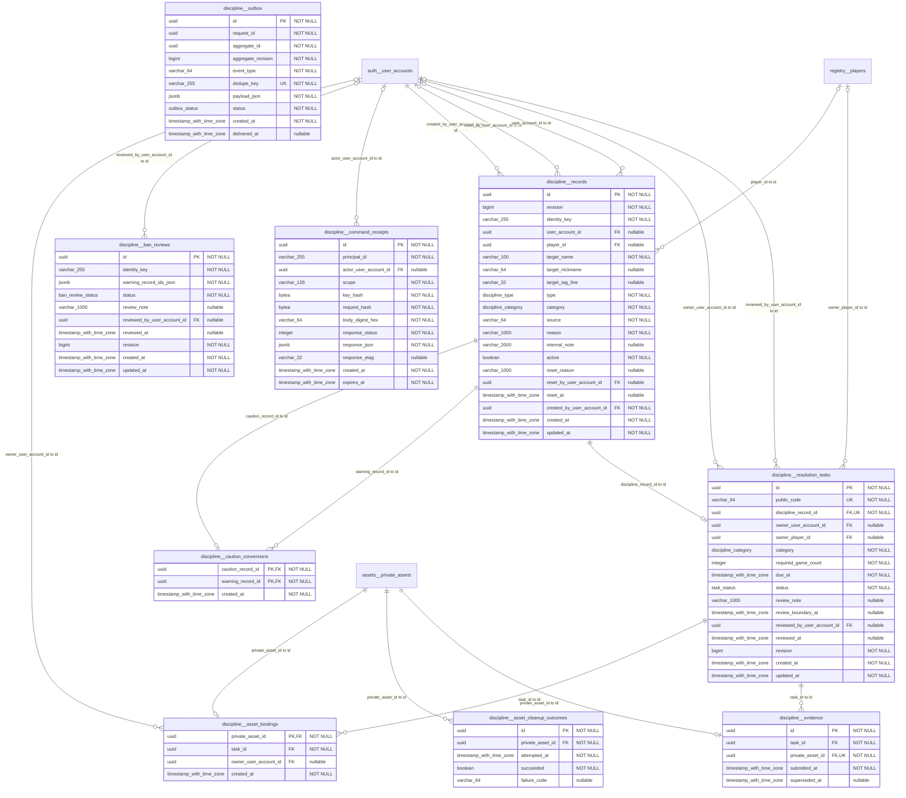

## legacy

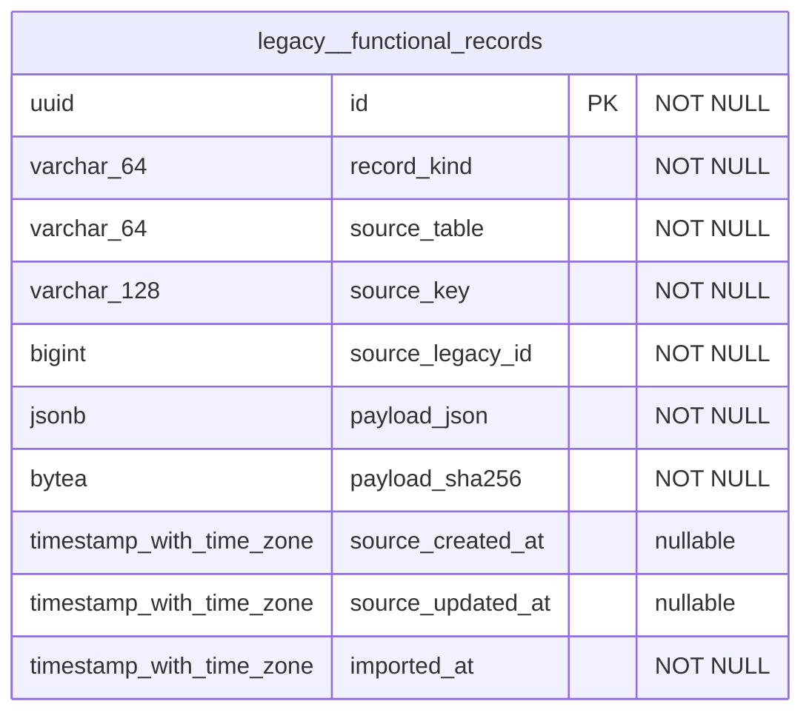

## media

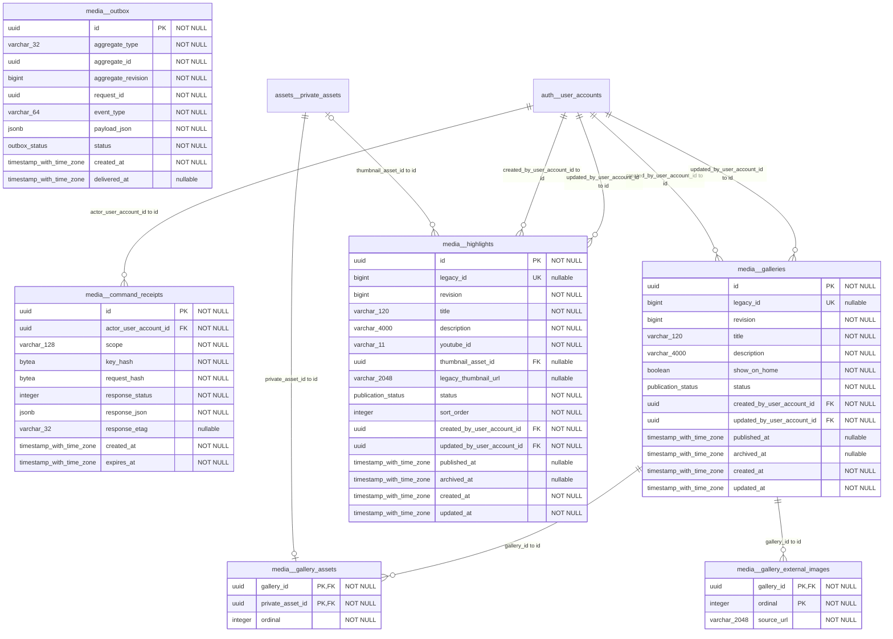

## mmr

```mermaid
erDiagram
    mmr__command_receipts {
        uuid id PK "NOT NULL"
        uuid actor_user_account_id FK "NOT NULL"
        varchar_96 scope "NOT NULL"
        bytea key_hash "NOT NULL"
        bytea request_hash "NOT NULL"
        integer response_status "NOT NULL"
        jsonb response_json "NOT NULL"
        varchar_32 response_etag "NOT NULL"
        timestamp_with_time_zone created_at "NOT NULL"
        timestamp_with_time_zone expires_at "NOT NULL"
    }
    mmr__consumer_receipts {
        uuid outbox_event_id PK, FK "NOT NULL"
        uuid run_id FK "NOT NULL"
        bigint generation "NOT NULL"
        uuid match_id FK "NOT NULL"
        bigint match_revision "NOT NULL"
        bytea input_digest "NOT NULL"
        timestamp_with_time_zone applied_at "NOT NULL"
    }
    mmr__manual_adjustments {
        uuid id PK "NOT NULL"
        uuid player_id FK "NOT NULL"
        match_position position "nullable"
        integer delta_bp "NOT NULL"
        varchar_64 reason_code "NOT NULL"
        varchar_300 public_note "NOT NULL"
        uuid actor_user_account_id FK "NOT NULL"
        timestamp_with_time_zone created_at "NOT NULL"
    }
    mmr__match_result_events {
        uuid id PK "NOT NULL"
        bigint generation "NOT NULL"
        uuid source_event_id FK "NOT NULL"
        uuid match_id FK "NOT NULL"
        uuid game_id FK "NOT NULL"
        integer game_number "NOT NULL"
        uuid player_id FK "NOT NULL"
        varchar_8 team "NOT NULL"
        match_position position "NOT NULL"
        boolean won "NOT NULL"
        integer expected_win_rate_bp "NOT NULL"
        integer actual_performance_bp "NOT NULL"
        integer overall_delta_bp "NOT NULL"
        integer position_delta_bp "NOT NULL"
        varchar_48 formula_version "NOT NULL"
        timestamp_with_time_zone created_at "NOT NULL"
    }
    mmr__outbox {
        uuid id PK "NOT NULL"
        uuid request_id UK "NOT NULL"
        uuid run_id FK "NOT NULL"
        bigint generation "NOT NULL"
        varchar_64 event_type "NOT NULL"
        outbox_status status "NOT NULL"
        timestamp_with_time_zone created_at "NOT NULL"
        timestamp_with_time_zone delivered_at "nullable"
    }
    mmr__player_position_profiles {
        bigint generation PK "NOT NULL"
        uuid player_id PK, FK "NOT NULL"
        match_position position PK "NOT NULL"
        integer score_bp "NOT NULL"
        integer sample_size "NOT NULL"
        timestamp_with_time_zone calculated_at "NOT NULL"
    }
    mmr__player_profiles {
        bigint generation PK "NOT NULL"
        uuid player_id PK, FK "NOT NULL"
        integer overall_score_bp "NOT NULL"
        integer confidence_bp "NOT NULL"
        integer sample_size "NOT NULL"
        varchar_48 formula_version "NOT NULL"
        timestamp_with_time_zone calculated_at "NOT NULL"
    }
    mmr__projection_runs {
        uuid id PK "NOT NULL"
        projection_trigger trigger "NOT NULL"
        uuid actor_user_account_id FK "nullable"
        bigint base_generation "NOT NULL"
        bigint result_generation UK "NOT NULL"
        integer source_match_count "NOT NULL"
        integer source_game_count "NOT NULL"
        integer source_adjustment_count "NOT NULL"
        bytea source_checksum "NOT NULL"
        timestamp_with_time_zone started_at "NOT NULL"
        timestamp_with_time_zone completed_at "NOT NULL"
    }
    mmr__projection_states {
        varchar_16 key PK "NOT NULL"
        bigint generation "NOT NULL"
        projection_status status "NOT NULL"
        varchar_48 formula_version "nullable"
        integer source_match_count "NOT NULL"
        integer source_game_count "NOT NULL"
        integer source_adjustment_count "NOT NULL"
        bytea source_checksum "nullable"
        timestamp_with_time_zone calculated_at "nullable"
        timestamp_with_time_zone created_at "NOT NULL"
        timestamp_with_time_zone updated_at "NOT NULL"
    }
    auth__user_accounts ||--o{ mmr__command_receipts : "actor_user_account_id to id"
    auth__user_accounts ||--o{ mmr__manual_adjustments : "actor_user_account_id to id"
    auth__user_accounts o|--o{ mmr__projection_runs : "actor_user_account_id to id"
    competition__match_games ||--o{ mmr__match_result_events : "game_id to id"
    competition__match_recalculation_outbox ||--o| mmr__consumer_receipts : "outbox_event_id to id"
    competition__match_series ||--o{ mmr__consumer_receipts : "match_id to id"
    competition__match_series ||--o{ mmr__match_result_events : "match_id to id"
    competition__match_series ||--o{ mmr__match_result_events : "source_event_id to id"
    mmr__projection_runs ||--o{ mmr__consumer_receipts : "run_id to id"
    mmr__projection_runs ||--o{ mmr__outbox : "run_id to id"
    registry__players ||--o{ mmr__manual_adjustments : "player_id to id"
    registry__players ||--o{ mmr__match_result_events : "player_id to id"
    registry__players ||--o{ mmr__player_position_profiles : "player_id to id"
    registry__players ||--o{ mmr__player_profiles : "player_id to id"
```

## operations

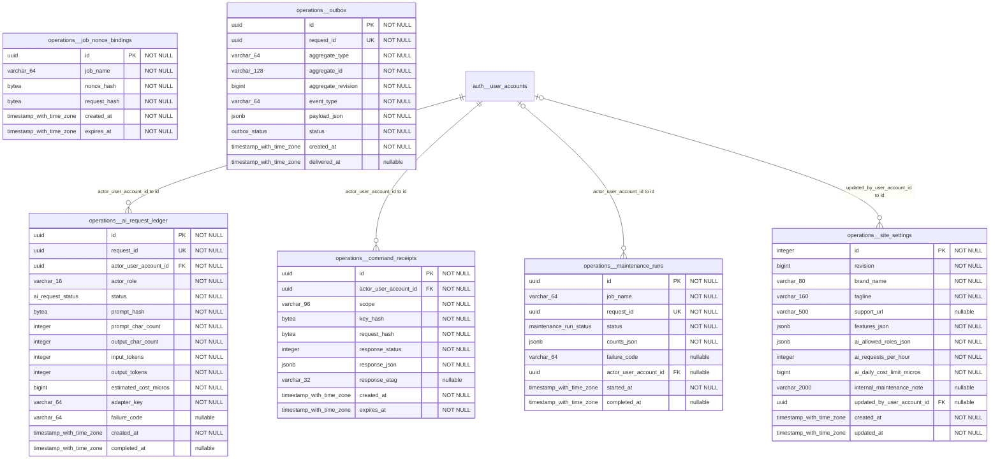

## recruiting

```mermaid
erDiagram
    recruiting__command_receipts {
        uuid id PK "NOT NULL"
        varchar_160 actor_principal_id "NOT NULL"
        varchar_160 scope "NOT NULL"
        bytea key_hash "NOT NULL"
        bytea request_hash "NOT NULL"
        varchar_64 body_digest_hex "NOT NULL"
        integer response_status "nullable"
        jsonb response_json "nullable"
        bigint response_revision "nullable"
        timestamp_with_time_zone created_at "NOT NULL"
        timestamp_with_time_zone expires_at "NOT NULL"
    }
    recruiting__kakao_bot_installations {
        uuid id PK "NOT NULL"
        bigint revision "NOT NULL"
        varchar_128 public_id UK "NOT NULL"
        varchar_120 display_name "NOT NULL"
        varchar_128 key_id "NOT NULL"
        varchar_128 last_bot_version "nullable"
        uuid canonical_room_id FK "nullable"
        kakao_bot_installation_status status "NOT NULL"
        timestamp_with_time_zone first_seen_at "NOT NULL"
        timestamp_with_time_zone last_seen_at "NOT NULL"
    }
    recruiting__kakao_image_sessions {
        uuid id PK "NOT NULL"
        uuid created_by_user_account_id FK "NOT NULL"
        kakao_image_target_type target_type "NOT NULL"
        uuid target_id "NOT NULL"
        bytea room_id_hash "NOT NULL"
        bytea sender_id_hash "NOT NULL"
        integer expected_image_count "NOT NULL"
        integer received_image_count "NOT NULL"
        kakao_image_session_status status "NOT NULL"
        timestamp_with_time_zone expires_at "NOT NULL"
        timestamp_with_time_zone completed_at "nullable"
        timestamp_with_time_zone cancelled_at "nullable"
        timestamp_with_time_zone created_at "NOT NULL"
        timestamp_with_time_zone updated_at "NOT NULL"
    }
    recruiting__kakao_inbound_images {
        uuid id PK "NOT NULL"
        uuid session_id FK "NOT NULL"
        uuid private_asset_id FK, UK "NOT NULL"
        integer image_number "NOT NULL"
        bytea request_digest UK "NOT NULL"
        bytea sha256 "NOT NULL"
        kakao_inbound_image_status status "NOT NULL"
        timestamp_with_time_zone created_at "NOT NULL"
        timestamp_with_time_zone ready_at "nullable"
        timestamp_with_time_zone delete_requested_at "nullable"
    }
    recruiting__kakao_operation_settings {
        integer id PK "NOT NULL"
        bigint revision "NOT NULL"
        boolean global_enabled "NOT NULL"
        boolean maintenance_mode "NOT NULL"
        boolean player_search_enabled "NOT NULL"
        boolean season_applications_enabled "NOT NULL"
        boolean image_receive_enabled "NOT NULL"
        boolean recruiting_enabled "NOT NULL"
        boolean scheduled_notice_enabled "NOT NULL"
        integer max_message_length "NOT NULL"
        uuid updated_by_user_account_id FK "nullable"
        timestamp_with_time_zone updated_at "NOT NULL"
    }
    recruiting__kakao_room_bindings {
        uuid id PK "NOT NULL"
        bigint revision "NOT NULL"
        uuid installation_id FK "NOT NULL"
        varchar_128 local_room_fingerprint "NOT NULL"
        uuid room_id FK "NOT NULL"
        kakao_room_registration_source registration_source "NOT NULL"
        timestamp_with_time_zone created_at "NOT NULL"
        timestamp_with_time_zone updated_at "NOT NULL"
    }
    recruiting__kakao_room_members {
        uuid id PK "NOT NULL"
        bigint revision "NOT NULL"
        uuid room_id FK "NOT NULL"
        varchar_128 sender_fingerprint "NOT NULL"
        uuid linked_user_account_id FK "nullable"
        uuid linked_player_id FK "nullable"
        kakao_room_member_role role "NOT NULL"
        timestamp_with_time_zone last_activity_at "NOT NULL"
        timestamp_with_time_zone created_at "NOT NULL"
        timestamp_with_time_zone updated_at "NOT NULL"
    }
    recruiting__kakao_room_pairings {
        uuid id PK "NOT NULL"
        uuid target_room_id FK "nullable"
        varchar_120 display_name "NOT NULL"
        kakao_room_capability_profile capability_profile "NOT NULL"
        bytea code_hash UK "NOT NULL"
        timestamp_with_time_zone expires_at "NOT NULL"
        timestamp_with_time_zone consumed_at "nullable"
        uuid consumed_room_id FK "nullable"
        uuid consumed_installation_id FK "nullable"
        varchar_128 consumed_local_room_fingerprint "nullable"
        varchar_128 consumed_sender_fingerprint "nullable"
        bytea consumed_request_key_hash "nullable"
        uuid created_by_user_account_id FK "NOT NULL"
        timestamp_with_time_zone created_at "NOT NULL"
    }
    recruiting__kakao_rooms {
        uuid id PK "NOT NULL"
        bigint revision "NOT NULL"
        varchar_120 display_name "NOT NULL"
        kakao_room_status status "NOT NULL"
        kakao_room_capability_profile capability_profile "NOT NULL"
        kakao_room_registration_source registration_source "NOT NULL"
        integer policy_version "NOT NULL"
        uuid registered_by_user_account_id FK "nullable"
        timestamp_with_time_zone registered_at "NOT NULL"
        timestamp_with_time_zone updated_at "NOT NULL"
    }
    recruiting__nonce_bindings {
        uuid id PK "NOT NULL"
        varchar_12 actor_kind "NOT NULL"
        varchar_160 actor_principal_id "NOT NULL"
        bytea nonce_hash "NOT NULL"
        bytea binding_hash "NOT NULL"
        varchar_128 key_id "NOT NULL"
        timestamp_with_time_zone created_at "NOT NULL"
        timestamp_with_time_zone expires_at "NOT NULL"
    }
    recruiting__operation_forms {
        uuid id PK "NOT NULL"
        bigint revision "NOT NULL"
        operation_form_type form_type "NOT NULL"
        operation_form_status status "NOT NULL"
        jsonb payload_json "NOT NULL"
        varchar_128 source_room_id "NOT NULL"
        varchar_128 source_sender_id "NOT NULL"
        varchar_2000 admin_note "nullable"
        uuid reviewed_by_user_account_id FK "nullable"
        timestamp_with_time_zone reviewed_at "nullable"
        timestamp_with_time_zone deleted_at "nullable"
        uuid deleted_by_user_account_id FK "nullable"
        varchar_500 deletion_reason "nullable"
        timestamp_with_time_zone submitted_at "NOT NULL"
        timestamp_with_time_zone created_at "NOT NULL"
        timestamp_with_time_zone updated_at "NOT NULL"
    }
    recruiting__outbox {
        varchar_200 id PK "NOT NULL"
        uuid request_id UK "NOT NULL"
        varchar_32 aggregate_type "NOT NULL"
        uuid aggregate_id "NOT NULL"
        bigint aggregate_revision "NOT NULL"
        varchar_96 event_type "NOT NULL"
        varchar_240 dedupe_key UK "NOT NULL"
        jsonb payload_json "NOT NULL"
        outbox_status status "NOT NULL"
        timestamp_with_time_zone created_at "NOT NULL"
        timestamp_with_time_zone delivered_at "nullable"
    }
    recruiting__parties {
        uuid id PK "NOT NULL"
        bigint revision "NOT NULL"
        uuid owner_user_account_id FK "nullable"
        varchar_128 source_room_id "nullable"
        varchar_128 source_sender_id "nullable"
        date recruit_date "NOT NULL"
        integer reset_sequence "NOT NULL"
        integer recruit_number "NOT NULL"
        party_type type "NOT NULL"
        party_status status "NOT NULL"
        varchar_160 title "NOT NULL"
        integer maximum_members "NOT NULL"
        jsonb members_json "NOT NULL"
        varchar_160 start_time_text "NOT NULL"
        varchar_500 game_info "NOT NULL"
        timestamp_with_time_zone scheduled_start_at "nullable"
        timestamp_with_time_zone protected_until "nullable"
        timestamp_with_time_zone last_activity_at "NOT NULL"
        timestamp_with_time_zone created_at "NOT NULL"
        timestamp_with_time_zone updated_at "NOT NULL"
    }
    recruiting__scrims {
        uuid id PK "NOT NULL"
        bigint revision "NOT NULL"
        uuid owner_user_account_id FK "nullable"
        varchar_128 source_room_id "nullable"
        varchar_128 source_sender_id "nullable"
        varchar_128 opponent_sender_id "nullable"
        date recruit_date "NOT NULL"
        integer scrim_number "NOT NULL"
        uuid tournament_id "nullable"
        integer legacy_tournament_number "nullable"
        uuid requester_team_id "nullable"
        uuid opponent_team_id "nullable"
        varchar_160 legacy_title "nullable"
        varchar_120 requester_team_name "nullable"
        varchar_120 opponent_team_name "nullable"
        jsonb requester_lineup_json "nullable"
        jsonb opponent_lineup_json "nullable"
        varchar_500 legacy_memo "nullable"
        varchar_160 legacy_series_rule_text "nullable"
        scrim_status status "NOT NULL"
        timestamp_with_time_zone scheduled_at "nullable"
        integer best_of "nullable"
        timestamp_with_time_zone created_at "NOT NULL"
        timestamp_with_time_zone updated_at "NOT NULL"
    }
    assets__private_assets ||--o| recruiting__kakao_inbound_images : "private_asset_id to id"
    auth__user_accounts ||--o{ recruiting__kakao_image_sessions : "created_by_user_account_id to id"
    auth__user_accounts o|--o{ recruiting__kakao_operation_settings : "updated_by_user_account_id to id"
    auth__user_accounts o|--o{ recruiting__kakao_room_members : "linked_user_account_id to id"
    auth__user_accounts ||--o{ recruiting__kakao_room_pairings : "created_by_user_account_id to id"
    auth__user_accounts o|--o{ recruiting__kakao_rooms : "registered_by_user_account_id to id"
    auth__user_accounts o|--o{ recruiting__operation_forms : "deleted_by_user_account_id to id"
    auth__user_accounts o|--o{ recruiting__operation_forms : "reviewed_by_user_account_id to id"
    auth__user_accounts o|--o{ recruiting__parties : "owner_user_account_id to id"
    auth__user_accounts o|--o{ recruiting__scrims : "owner_user_account_id to id"
    recruiting__kakao_bot_installations ||--o{ recruiting__kakao_room_bindings : "installation_id to id"
    recruiting__kakao_bot_installations o|--o{ recruiting__kakao_room_pairings : "consumed_installation_id to id"
    recruiting__kakao_image_sessions ||--o{ recruiting__kakao_inbound_images : "session_id to id"
    recruiting__kakao_rooms o|--o{ recruiting__kakao_bot_installations : "canonical_room_id to id"
    recruiting__kakao_rooms ||--o{ recruiting__kakao_room_bindings : "room_id to id"
    recruiting__kakao_rooms ||--o{ recruiting__kakao_room_members : "room_id to id"
    recruiting__kakao_rooms o|--o{ recruiting__kakao_room_pairings : "consumed_room_id to id"
    recruiting__kakao_rooms o|--o{ recruiting__kakao_room_pairings : "target_room_id to id"
    registry__players o|--o{ recruiting__kakao_room_members : "linked_player_id to id"
```

## registry

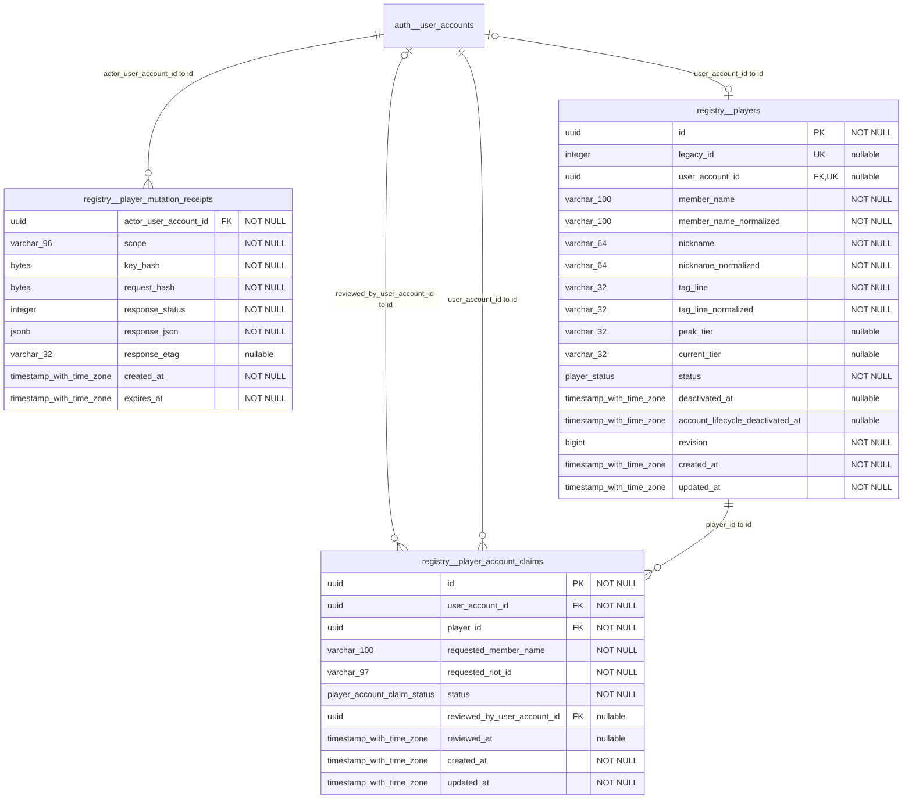

## riot

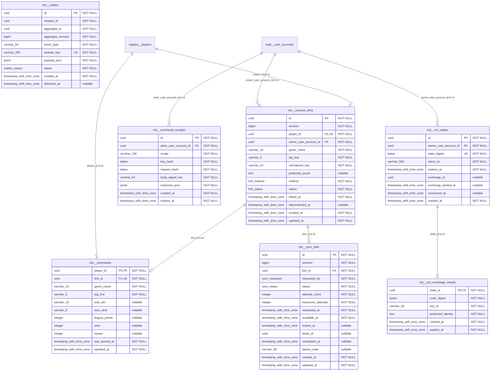

## statistics

```mermaid
erDiagram
    statistics__match_projection_receipts {
        uuid outbox_event_id PK, FK "NOT NULL"
        uuid match_id FK "NOT NULL"
        bigint match_revision "NOT NULL"
        varchar_32 action "NOT NULL"
        uuid old_season_id FK "nullable"
        uuid new_season_id FK "nullable"
        bytea input_digest "NOT NULL"
        timestamp_with_time_zone applied_at "NOT NULL"
    }
    statistics__player_champion_stats {
        uuid season_id PK, FK "NOT NULL"
        uuid player_id PK, FK "NOT NULL"
        varchar_64 champion_key PK, FK "NOT NULL"
        bigint generation "NOT NULL"
        integer games "NOT NULL"
        integer wins "NOT NULL"
        integer losses "NOT NULL"
        integer mvp_count "NOT NULL"
        timestamp_with_time_zone calculated_at "NOT NULL"
    }
    statistics__player_position_stats {
        uuid season_id PK, FK "NOT NULL"
        uuid player_id PK, FK "NOT NULL"
        match_position position PK "NOT NULL"
        bigint generation "NOT NULL"
        integer games "NOT NULL"
        integer wins "NOT NULL"
        integer losses "NOT NULL"
        timestamp_with_time_zone calculated_at "NOT NULL"
    }
    statistics__player_season_stats {
        uuid season_id PK, FK "NOT NULL"
        uuid player_id PK, FK "NOT NULL"
        bigint generation "NOT NULL"
        integer total_games "NOT NULL"
        integer participation_count "NOT NULL"
        integer wins "NOT NULL"
        integer losses "NOT NULL"
        integer mvp_count "NOT NULL"
        timestamp_with_time_zone calculated_at "NOT NULL"
    }
    statistics__projection_runs {
        uuid id PK "NOT NULL"
        uuid season_id FK "NOT NULL"
        statistics_projection_run_trigger trigger "NOT NULL"
        statistics_projection_run_status status "NOT NULL"
        uuid requested_outbox_event_id FK "nullable"
        bigint base_generation "NOT NULL"
        bigint result_generation "nullable"
        integer source_match_count "NOT NULL"
        integer source_game_count "NOT NULL"
        integer source_participant_count "NOT NULL"
        bytea source_checksum "nullable"
        varchar_64 failure_code "nullable"
        timestamp_with_time_zone started_at "NOT NULL"
        timestamp_with_time_zone completed_at "nullable"
    }
    statistics__season_projection_states {
        uuid season_id PK, FK "NOT NULL"
        bigint generation "NOT NULL"
        season_projection_status status "NOT NULL"
        integer source_match_count "NOT NULL"
        integer source_game_count "NOT NULL"
        integer source_participant_count "NOT NULL"
        bytea source_checksum "nullable"
        timestamp_with_time_zone calculated_at "nullable"
        timestamp_with_time_zone created_at "NOT NULL"
        timestamp_with_time_zone updated_at "NOT NULL"
    }
    catalog__champions ||--o{ statistics__player_champion_stats : "champion_key to key"
    competition__match_recalculation_outbox ||--o| statistics__match_projection_receipts : "outbox_event_id to id"
    competition__match_recalculation_outbox o|--o{ statistics__projection_runs : "requested_outbox_event_id to id"
    competition__match_series ||--o{ statistics__match_projection_receipts : "match_id to id"
    competition__seasons o|--o{ statistics__match_projection_receipts : "new_season_id to id"
    competition__seasons o|--o{ statistics__match_projection_receipts : "old_season_id to id"
    competition__seasons ||--o{ statistics__player_champion_stats : "season_id to id"
    competition__seasons ||--o{ statistics__player_position_stats : "season_id to id"
    competition__seasons ||--o{ statistics__player_season_stats : "season_id to id"
    competition__seasons ||--o{ statistics__projection_runs : "season_id to id"
    competition__seasons ||--o| statistics__season_projection_states : "season_id to id"
    registry__players ||--o{ statistics__player_champion_stats : "player_id to id"
    registry__players ||--o{ statistics__player_position_stats : "player_id to id"
    registry__players ||--o{ statistics__player_season_stats : "player_id to id"
```

## team_tools

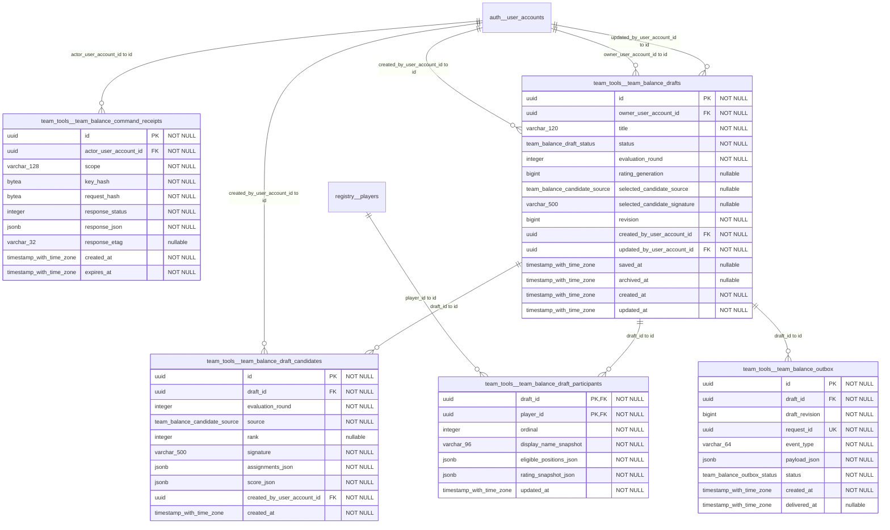
