# K-LOL.GG V2 전체 페이지 화면 검수

- 캡처 시각: 2026-09-07T12:18:18.656Z
- 기준 주소: http://127.0.0.1:50875
- 전체 화면: 326개
- 자동 감지 문제: 0개

## 한눈에 보기

### public 1

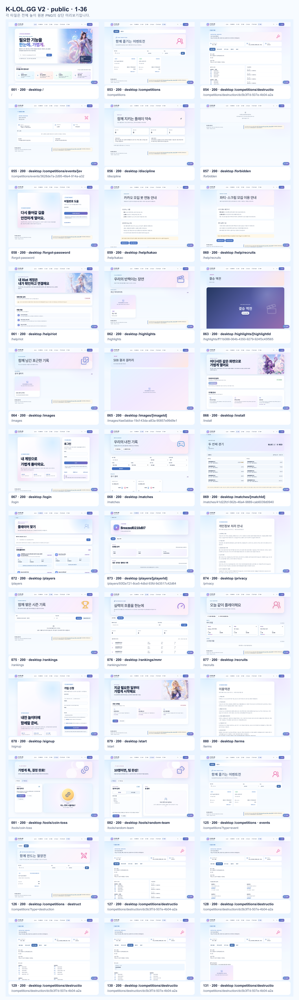

### public 2

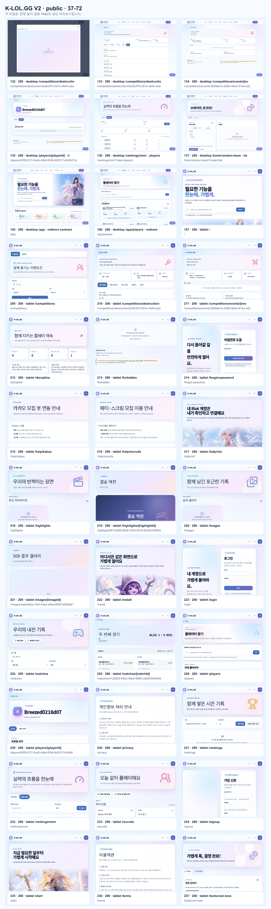

### public 3

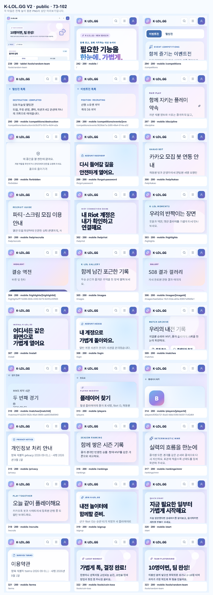

### account 1

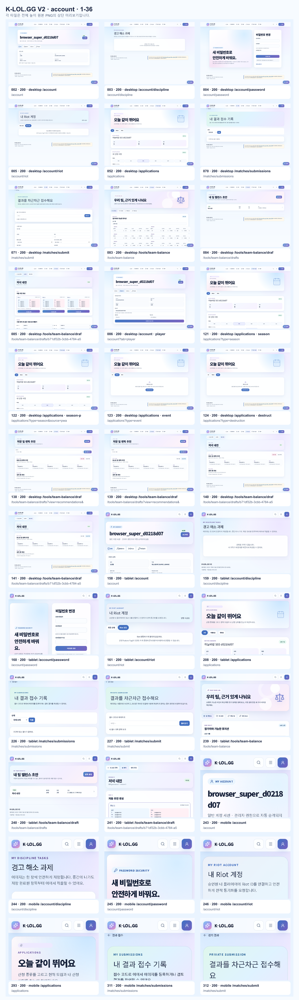

### account 2

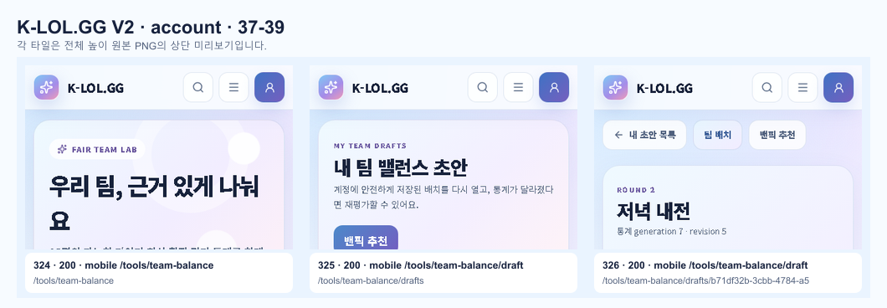

### admin 1

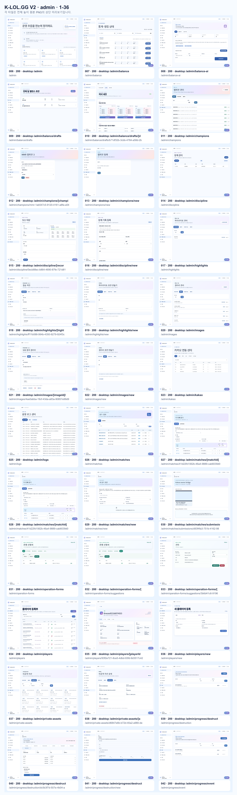

### admin 2

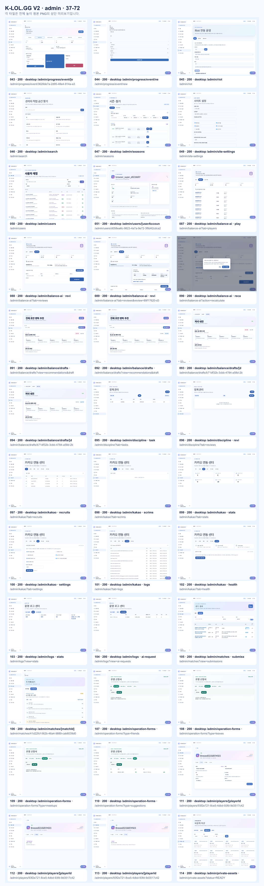

### admin 3

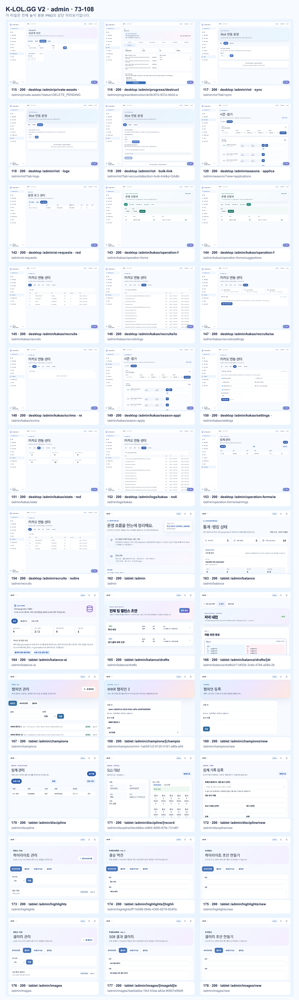

### admin 4

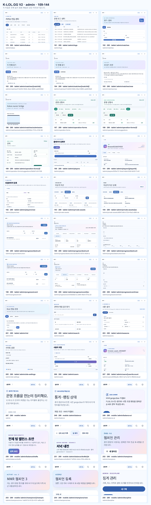

### admin 5

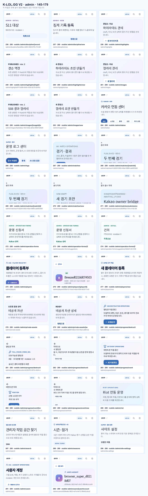

### admin-auth 1

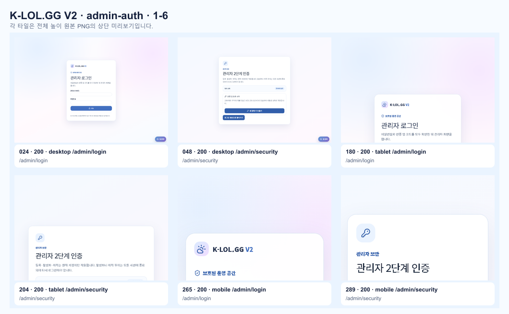

## 원본 전체 높이 PNG

| 번호 | 그룹 | 요청 경로 | 최종 상태 | 크기 | 자동 점검 | 원본 |
| ---: | --- | --- | ---: | --- | --- | --- |
| 1 | public | `/` | 200 | 1440×2383 | 통과 | [PNG](./001-desktop.png) |
| 2 | account | `/account` | 200 | 1440×1000 | 통과 | [PNG](./002-desktop-account.png) |
| 3 | account | `/account/discipline` | 200 | 1440×1000 | 통과 | [PNG](./003-desktop-account-discipline.png) |
| 4 | account | `/account/password` | 200 | 1440×1000 | 통과 | [PNG](./004-desktop-account-password.png) |
| 5 | account | `/account/riot` | 200 | 1440×1000 | 통과 | [PNG](./005-desktop-account-riot.png) |
| 6 | admin | `/admin` | 200 | 1440×1320 | 통과 | [PNG](./006-desktop-admin.png) |
| 7 | admin | `/admin/balance` | 200 | 1440×2102 | 통과 | [PNG](./007-desktop-admin-balance.png) |
| 8 | admin | `/admin/balance-ai` | 200 | 1440×1000 | 통과 | [PNG](./008-desktop-admin-balance-ai.png) |
| 9 | admin | `/admin/balance/drafts` | 200 | 1440×1000 | 통과 | [PNG](./009-desktop-admin-balance-drafts.png) |
| 10 | admin | `/admin/balance/drafts/b71df32b-3cbb-4784-a58d-2b99828a46ae` | 200 | 1440×1432 | 통과 | [PNG](./010-desktop-admin-balance-drafts-draftId.png) |
| 11 | admin | `/admin/champions` | 200 | 1440×2197 | 통과 | [PNG](./011-desktop-admin-champions.png) |
| 12 | admin | `/admin/champions/mmr-1ab547c5-9120-4161-a8fa-a544f2849606/edit` | 200 | 1440×1000 | 통과 | [PNG](./012-desktop-admin-champions-championId-edit.png) |
| 13 | admin | `/admin/champions/new` | 200 | 1440×1000 | 통과 | [PNG](./013-desktop-admin-champions-new.png) |
| 14 | admin | `/admin/discipline` | 200 | 1440×1000 | 통과 | [PNG](./014-desktop-admin-discipline.png) |
| 15 | admin | `/admin/discipline/0ecb88ec-b864-4690-87fe-721d813d88f7` | 200 | 1440×1040 | 통과 | [PNG](./015-desktop-admin-discipline-recordId.png) |
| 16 | admin | `/admin/discipline/new` | 200 | 1440×1213 | 통과 | [PNG](./016-desktop-admin-discipline-new.png) |
| 17 | admin | `/admin/highlights` | 200 | 1440×1000 | 통과 | [PNG](./017-desktop-admin-highlights.png) |
| 18 | admin | `/admin/highlights/ff11b088-064b-4350-9279-924f3c45f565/edit` | 200 | 1440×1134 | 통과 | [PNG](./018-desktop-admin-highlights-highlightId-edit.png) |
| 19 | admin | `/admin/highlights/new` | 200 | 1440×1000 | 통과 | [PNG](./019-desktop-admin-highlights-new.png) |
| 20 | admin | `/admin/images` | 200 | 1440×1000 | 통과 | [PNG](./020-desktop-admin-images.png) |
| 21 | admin | `/admin/images/4ae0abba-19cf-43da-a83a-90857e99d9e1/edit` | 200 | 1440×1045 | 통과 | [PNG](./021-desktop-admin-images-imageId-edit.png) |
| 22 | admin | `/admin/images/new` | 200 | 1440×1000 | 통과 | [PNG](./022-desktop-admin-images-new.png) |
| 23 | admin | `/admin/kakao` | 200 | 1440×1000 | 통과 | [PNG](./023-desktop-admin-kakao.png) |
| 24 | admin-auth | `/admin/login` | 200 | 1440×1000 | 통과 | [PNG](./024-desktop-admin-login.png) |
| 25 | admin | `/admin/logs` | 200 | 1440×2618 | 통과 | [PNG](./025-desktop-admin-logs.png) |
| 26 | admin | `/admin/matches` | 200 | 1440×1000 | 통과 | [PNG](./026-desktop-admin-matches.png) |
| 27 | admin | `/admin/matches/41d22fcf-562b-46a4-9889-cab6039d0940` | 200 | 1440×1713 | 통과 | [PNG](./027-desktop-admin-matches-matchId.png) |
| 28 | admin | `/admin/matches/41d22fcf-562b-46a4-9889-cab6039d0940/edit` | 200 | 1440×1713 | 통과 | [PNG](./028-desktop-admin-matches-matchId-edit.png) |
| 29 | admin | `/admin/matches/new` | 200 | 1440×2383 | 통과 | [PNG](./029-desktop-admin-matches-new.png) |
| 30 | admin | `/admin/matches/submissions/d93f4fa3-751b-4162-9898-282ccdcbf1f6` | 200 | 1440×3000 | 통과 | [PNG](./030-desktop-admin-matches-submissions-submissionId.png) |
| 31 | admin | `/admin/operation-forms` | 200 | 1440×1000 | 통과 | [PNG](./031-desktop-admin-operation-forms.png) |
| 32 | admin | `/admin/operation-forms/suggestions` | 200 | 1440×1000 | 통과 | [PNG](./032-desktop-admin-operation-forms-formType.png) |
| 33 | admin | `/admin/operation-forms/suggestions/3b6d41c6-9196-4384-ae30-31bd090e657c` | 200 | 1440×1000 | 통과 | [PNG](./033-desktop-admin-operation-forms-formType-id.png) |
| 34 | admin | `/admin/players` | 200 | 1440×2145 | 통과 | [PNG](./034-desktop-admin-players.png) |
| 35 | admin | `/admin/players/93f2e721-8ce5-4dbd-93fd-9d3517c42d64` | 200 | 1440×1000 | 통과 | [PNG](./035-desktop-admin-players-playerId.png) |
| 36 | admin | `/admin/players/new` | 200 | 1440×1000 | 통과 | [PNG](./036-desktop-admin-players-new.png) |
| 37 | admin | `/admin/private-assets` | 200 | 1440×1191 | 통과 | [PNG](./037-desktop-admin-private-assets.png) |
| 38 | admin | `/admin/private-assets/d6847e6b-b72d-40a2-a980-dead07eff9c1` | 200 | 1440×1000 | 통과 | [PNG](./038-desktop-admin-private-assets-assetId.png) |
| 39 | admin | `/admin/progress/destruction` | 200 | 1440×1000 | 통과 | [PNG](./039-desktop-admin-progress-destruction.png) |
| 40 | admin | `/admin/progress/destruction/dc5b3f7d-507e-4b04-a2a3-8fcc1b6a8576` | 200 | 1440×1001 | 통과 | [PNG](./040-desktop-admin-progress-destruction-tournamentId.png) |
| 41 | admin | `/admin/progress/destruction/new` | 200 | 1440×1000 | 통과 | [PNG](./041-desktop-admin-progress-destruction-new.png) |
| 42 | admin | `/admin/progress/event` | 200 | 1440×1000 | 통과 | [PNG](./042-desktop-admin-progress-event.png) |
| 43 | admin | `/admin/progress/event/3628de7a-2d95-48e4-914a-a32c687e9b89` | 200 | 1440×1000 | 통과 | [PNG](./043-desktop-admin-progress-event-eventId.png) |
| 44 | admin | `/admin/progress/event/new` | 200 | 1440×1000 | 통과 | [PNG](./044-desktop-admin-progress-event-new.png) |
| 45 | admin | `/admin/riot` | 200 | 1440×1412 | 통과 | [PNG](./045-desktop-admin-riot.png) |
| 46 | admin | `/admin/search` | 200 | 1440×1082 | 통과 | [PNG](./046-desktop-admin-search.png) |
| 47 | admin | `/admin/seasons` | 200 | 1440×5180 | 통과 | [PNG](./047-desktop-admin-seasons.png) |
| 48 | admin-auth | `/admin/security` | 200 | 1440×1000 | 통과 | [PNG](./048-desktop-admin-security.png) |
| 49 | admin | `/admin/site-settings` | 200 | 1440×1158 | 통과 | [PNG](./049-desktop-admin-site-settings.png) |
| 50 | admin | `/admin/users` | 200 | 1440×2071 | 통과 | [PNG](./050-desktop-admin-users.png) |
| 51 | admin | `/admin/users/d058ea6c-9823-4a7a-9e72-3f8d42cdca24` | 200 | 1440×2249 | 통과 | [PNG](./051-desktop-admin-users-userAccountId.png) |
| 52 | account | `/applications` | 200 | 1440×1776 | 통과 | [PNG](./052-desktop-applications.png) |
| 53 | public | `/competitions` | 200 | 1440×1015 | 통과 | [PNG](./053-desktop-competitions.png) |
| 54 | public | `/competitions/destruction/dc5b3f7d-507e-4b04-a2a3-8fcc1b6a8576` | 200 | 1440×2278 | 통과 | [PNG](./054-desktop-competitions-destruction-tournamentId.png) |
| 55 | public | `/competitions/events/3628de7a-2d95-48e4-914a-a32c687e9b89` | 200 | 1440×1000 | 통과 | [PNG](./055-desktop-competitions-events-eventId.png) |
| 56 | public | `/discipline` | 200 | 1440×1000 | 통과 | [PNG](./056-desktop-discipline.png) |
| 57 | public | `/forbidden` | 200 | 1440×1000 | 통과 | [PNG](./057-desktop-forbidden.png) |
| 58 | public | `/forgot-password` | 200 | 1440×1000 | 통과 | [PNG](./058-desktop-forgot-password.png) |
| 59 | public | `/help/kakao` | 200 | 1440×1096 | 통과 | [PNG](./059-desktop-help-kakao.png) |
| 60 | public | `/help/recruits` | 200 | 1440×1059 | 통과 | [PNG](./060-desktop-help-recruits.png) |
| 61 | public | `/help/riot` | 200 | 1440×1687 | 통과 | [PNG](./061-desktop-help-riot.png) |
| 62 | public | `/highlights` | 200 | 1440×1000 | 통과 | [PNG](./062-desktop-highlights.png) |
| 63 | public | `/highlights/ff11b088-064b-4350-9279-924f3c45f565` | 200 | 1440×1253 | 통과 | [PNG](./063-desktop-highlights-highlightId.png) |
| 64 | public | `/images` | 200 | 1440×1000 | 통과 | [PNG](./064-desktop-images.png) |
| 65 | public | `/images/4ae0abba-19cf-43da-a83a-90857e99d9e1` | 200 | 1440×1236 | 통과 | [PNG](./065-desktop-images-imageId.png) |
| 66 | public | `/install` | 200 | 1440×1385 | 통과 | [PNG](./066-desktop-install.png) |
| 67 | public | `/login` | 200 | 1440×1057 | 통과 | [PNG](./067-desktop-login.png) |
| 68 | public | `/matches` | 200 | 1440×1179 | 통과 | [PNG](./068-desktop-matches.png) |
| 69 | public | `/matches/41d22fcf-562b-46a4-9889-cab6039d0940` | 200 | 1440×1101 | 통과 | [PNG](./069-desktop-matches-matchId.png) |
| 70 | account | `/matches/submissions` | 200 | 1440×1000 | 통과 | [PNG](./070-desktop-matches-submissions.png) |
| 71 | account | `/matches/submit` | 200 | 1440×1418 | 통과 | [PNG](./071-desktop-matches-submit.png) |
| 72 | public | `/players` | 200 | 1440×2586 | 통과 | [PNG](./072-desktop-players.png) |
| 73 | public | `/players/93f2e721-8ce5-4dbd-93fd-9d3517c42d64` | 200 | 1440×1176 | 통과 | [PNG](./073-desktop-players-playerId.png) |
| 74 | public | `/privacy` | 200 | 1440×1440 | 통과 | [PNG](./074-desktop-privacy.png) |
| 75 | public | `/rankings` | 200 | 1440×1000 | 통과 | [PNG](./075-desktop-rankings.png) |
| 76 | public | `/rankings/mmr` | 200 | 1440×1636 | 통과 | [PNG](./076-desktop-rankings-mmr.png) |
| 77 | public | `/recruits` | 200 | 1440×1041 | 통과 | [PNG](./077-desktop-recruits.png) |
| 78 | public | `/signup` | 200 | 1440×1286 | 통과 | [PNG](./078-desktop-signup.png) |
| 79 | public | `/start` | 200 | 1440×1022 | 통과 | [PNG](./079-desktop-start.png) |
| 80 | public | `/terms` | 200 | 1440×1299 | 통과 | [PNG](./080-desktop-terms.png) |
| 81 | public | `/tools/coin-toss` | 200 | 1440×1131 | 통과 | [PNG](./081-desktop-tools-coin-toss.png) |
| 82 | public | `/tools/random-team` | 200 | 1440×1237 | 통과 | [PNG](./082-desktop-tools-random-team.png) |
| 83 | account | `/tools/team-balance` | 200 | 1440×1546 | 통과 | [PNG](./083-desktop-tools-team-balance.png) |
| 84 | account | `/tools/team-balance/drafts` | 200 | 1440×1000 | 통과 | [PNG](./084-desktop-tools-team-balance-drafts.png) |
| 85 | account | `/tools/team-balance/drafts/b71df32b-3cbb-4784-a58d-2b99828a46ae` | 200 | 1440×1599 | 통과 | [PNG](./085-desktop-tools-team-balance-drafts-draftId.png) |
| 86 | account | `/account?tab=player` | 200 | 1440×1149 | 통과 | [PNG](./086-desktop-account-player.png) |
| 87 | admin | `/admin/balance-ai?tab=players` | 200 | 1440×1571 | 통과 | [PNG](./087-desktop-admin-balance-ai-players.png) |
| 88 | admin | `/admin/balance-ai?tab=reviews` | 200 | 1440×1000 | 통과 | [PNG](./088-desktop-admin-balance-ai-reviews.png) |
| 89 | admin | `/admin/balance-ai?tab=reviews&review=89f17620-d3d1-4e19-b6cb-2bb9d4da3e52` | 200 | 1440×1190 | 통과 | [PNG](./089-desktop-admin-balance-ai-review-detail.png) |
| 90 | admin | `/admin/balance-ai?action=recalculate` | 200 | 1440×1000 | 통과 | [PNG](./090-desktop-admin-balance-ai-recalculate-confirmation.png) |
| 91 | admin | `/admin/balance/drafts?view=recommendations&draftId=b71df32b-3cbb-4784-a58d-2b99828a46ae&team=RED` | 200 | 1440×1000 | 통과 | [PNG](./091-desktop-admin-balance-drafts-recommendations-red.png) |
| 92 | admin | `/admin/balance/drafts?view=recommendations&draftId=b71df32b-3cbb-4784-a58d-2b99828a46ae&team=BLUE` | 200 | 1440×1000 | 통과 | [PNG](./092-desktop-admin-balance-drafts-recommendations-blue.png) |
| 93 | admin | `/admin/balance/drafts/b71df32b-3cbb-4784-a58d-2b99828a46ae?tab=recommendations&team=RED` | 200 | 1440×1000 | 통과 | [PNG](./093-desktop-admin-balance-drafts-draftId-recommendations-red.png) |
| 94 | admin | `/admin/balance/drafts/b71df32b-3cbb-4784-a58d-2b99828a46ae?tab=recommendations&team=BLUE` | 200 | 1440×1000 | 통과 | [PNG](./094-desktop-admin-balance-drafts-draftId-recommendations-blue.png) |
| 95 | admin | `/admin/discipline?tab=tasks` | 200 | 1440×1000 | 통과 | [PNG](./095-desktop-admin-discipline-tasks.png) |
| 96 | admin | `/admin/discipline?tab=reviews` | 200 | 1440×1000 | 통과 | [PNG](./096-desktop-admin-discipline-reviews.png) |
| 97 | admin | `/admin/kakao?tab=recruits` | 200 | 1440×1000 | 통과 | [PNG](./097-desktop-admin-kakao-recruits.png) |
| 98 | admin | `/admin/kakao?tab=scrims` | 200 | 1440×1000 | 통과 | [PNG](./098-desktop-admin-kakao-scrims.png) |
| 99 | admin | `/admin/kakao?tab=stats` | 200 | 1440×1000 | 통과 | [PNG](./099-desktop-admin-kakao-stats.png) |
| 100 | admin | `/admin/kakao?tab=settings` | 200 | 1440×1000 | 통과 | [PNG](./100-desktop-admin-kakao-settings.png) |
| 101 | admin | `/admin/kakao?tab=logs` | 200 | 1440×1172 | 통과 | [PNG](./101-desktop-admin-kakao-logs.png) |
| 102 | admin | `/admin/kakao?tab=health` | 200 | 1440×1000 | 통과 | [PNG](./102-desktop-admin-kakao-health.png) |
| 103 | admin | `/admin/logs?view=stats` | 200 | 1440×1000 | 통과 | [PNG](./103-desktop-admin-logs-stats.png) |
| 104 | admin | `/admin/logs?view=ai-requests` | 200 | 1440×1000 | 통과 | [PNG](./104-desktop-admin-logs-ai-requests.png) |
| 105 | admin | `/admin/matches?view=submissions` | 200 | 1440×1000 | 통과 | [PNG](./105-desktop-admin-matches-submissions.png) |
| 106 | admin | `/admin/matches/41d22fcf-562b-46a4-9889-cab6039d0940?tab=ai-review` | 200 | 1440×1179 | 통과 | [PNG](./106-desktop-admin-matches-matchId-ai-review.png) |
| 107 | admin | `/admin/operation-forms?type=friends` | 200 | 1440×1000 | 통과 | [PNG](./107-desktop-admin-operation-forms-friends.png) |
| 108 | admin | `/admin/operation-forms?type=leaves` | 200 | 1440×1000 | 통과 | [PNG](./108-desktop-admin-operation-forms-leaves.png) |
| 109 | admin | `/admin/operation-forms?type=meetups` | 200 | 1440×1000 | 통과 | [PNG](./109-desktop-admin-operation-forms-meetups.png) |
| 110 | admin | `/admin/operation-forms?type=suggestions` | 200 | 1440×1000 | 통과 | [PNG](./110-desktop-admin-operation-forms-suggestions.png) |
| 111 | admin | `/admin/players/93f2e721-8ce5-4dbd-93fd-9d3517c42d64?mode=edit` | 200 | 1440×1000 | 통과 | [PNG](./111-desktop-admin-players-playerId-edit.png) |
| 112 | admin | `/admin/players/93f2e721-8ce5-4dbd-93fd-9d3517c42d64?tab=balance` | 200 | 1440×1000 | 통과 | [PNG](./112-desktop-admin-players-playerId-balance.png) |
| 113 | admin | `/admin/players/93f2e721-8ce5-4dbd-93fd-9d3517c42d64?tab=riot` | 200 | 1440×1000 | 통과 | [PNG](./113-desktop-admin-players-playerId-riot.png) |
| 114 | admin | `/admin/private-assets?status=READY` | 200 | 1440×1191 | 통과 | [PNG](./114-desktop-admin-private-assets-ready.png) |
| 115 | admin | `/admin/private-assets?status=DELETE_PENDING` | 200 | 1440×1000 | 통과 | [PNG](./115-desktop-admin-private-assets-cleanup.png) |
| 116 | admin | `/admin/progress/destruction/dc5b3f7d-507e-4b04-a2a3-8fcc1b6a8576?tab=auction&mode=live` | 200 | 1440×1093 | 통과 | [PNG](./116-desktop-admin-progress-destruction-tournamentId-live-auction.png) |
| 117 | admin | `/admin/riot?tab=sync` | 200 | 1440×1000 | 통과 | [PNG](./117-desktop-admin-riot-sync.png) |
| 118 | admin | `/admin/riot?tab=logs` | 200 | 1440×1000 | 통과 | [PNG](./118-desktop-admin-riot-logs.png) |
| 119 | admin | `/admin/riot?tab=accounts&action=bulk-link&q=QA&batchSize=10` | 200 | 1440×1117 | 통과 | [PNG](./119-desktop-admin-riot-bulk-link.png) |
| 120 | admin | `/admin/seasons?view=applications` | 200 | 1440×5180 | 통과 | [PNG](./120-desktop-admin-seasons-applications.png) |
| 121 | account | `/applications?type=season` | 200 | 1440×1776 | 통과 | [PNG](./121-desktop-applications-season.png) |
| 122 | account | `/applications?type=season&source=pwa` | 200 | 1440×1776 | 통과 | [PNG](./122-desktop-applications-season-pwa-entry.png) |
| 123 | account | `/applications?type=event` | 200 | 1440×1000 | 통과 | [PNG](./123-desktop-applications-event.png) |
| 124 | account | `/applications?type=destruction` | 200 | 1440×1000 | 통과 | [PNG](./124-desktop-applications-destruction.png) |
| 125 | public | `/competitions?type=event` | 200 | 1440×1015 | 통과 | [PNG](./125-desktop-competitions-events.png) |
| 126 | public | `/competitions?type=destruction` | 200 | 1440×1015 | 통과 | [PNG](./126-desktop-competitions-destruction.png) |
| 127 | public | `/competitions/destruction/dc5b3f7d-507e-4b04-a2a3-8fcc1b6a8576?action=apply` | 200 | 1440×2278 | 통과 | [PNG](./127-desktop-competitions-destruction-tournamentId-apply.png) |
| 128 | public | `/competitions/destruction/dc5b3f7d-507e-4b04-a2a3-8fcc1b6a8576?tab=captain-points` | 200 | 1440×1250 | 통과 | [PNG](./128-desktop-competitions-destruction-tournamentId-captain-points.png) |
| 129 | public | `/competitions/destruction/dc5b3f7d-507e-4b04-a2a3-8fcc1b6a8576?tab=participants` | 200 | 1440×1336 | 통과 | [PNG](./129-desktop-competitions-destruction-tournamentId-participants.png) |
| 130 | public | `/competitions/destruction/dc5b3f7d-507e-4b04-a2a3-8fcc1b6a8576?tab=participants&player=6d6ea237-f66b-4282-ae91-22a3401a6b12` | 200 | 1440×1455 | 통과 | [PNG](./130-desktop-competitions-destruction-tournamentId-participant-detail.png) |
| 131 | public | `/competitions/destruction/dc5b3f7d-507e-4b04-a2a3-8fcc1b6a8576?tab=gallery` | 200 | 1440×1208 | 통과 | [PNG](./131-desktop-competitions-destruction-tournamentId-gallery.png) |
| 132 | public | `/competitions/destruction/dc5b3f7d-507e-4b04-a2a3-8fcc1b6a8576?tab=gallery&imageIndex=0` | 200 | 1440×1208 | 통과 | [PNG](./132-desktop-competitions-destruction-tournamentId-gallery-lightbox.png) |
| 133 | public | `/competitions/destruction/dc5b3f7d-507e-4b04-a2a3-8fcc1b6a8576?tab=mvp` | 200 | 1440×1544 | 통과 | [PNG](./133-desktop-competitions-destruction-tournamentId-mvp.png) |
| 134 | public | `/competitions/events/3628de7a-2d95-48e4-914a-a32c687e9b89?action=apply` | 200 | 1440×1000 | 통과 | [PNG](./134-desktop-competitions-events-eventId-apply.png) |
| 135 | public | `/players/93f2e721-8ce5-4dbd-93fd-9d3517c42d64?tab=riot` | 200 | 1440×1000 | 통과 | [PNG](./135-desktop-players-playerId-riot.png) |
| 136 | public | `/rankings/mmr?view=players` | 200 | 1440×1636 | 통과 | [PNG](./136-desktop-rankings-mmr-players.png) |
| 137 | public | `/tools/random-team?mode=tier` | 200 | 1440×1237 | 통과 | [PNG](./137-desktop-tools-random-team-tier.png) |
| 138 | account | `/tools/team-balance/drafts?view=recommendations&draftId=b71df32b-3cbb-4784-a58d-2b99828a46ae&team=RED` | 200 | 1440×1037 | 통과 | [PNG](./138-desktop-tools-team-balance-drafts-recommendations-red.png) |
| 139 | account | `/tools/team-balance/drafts?view=recommendations&draftId=b71df32b-3cbb-4784-a58d-2b99828a46ae&team=BLUE` | 200 | 1440×1037 | 통과 | [PNG](./139-desktop-tools-team-balance-drafts-recommendations-blue.png) |
| 140 | account | `/tools/team-balance/drafts/b71df32b-3cbb-4784-a58d-2b99828a46ae?tab=recommendations&team=RED` | 200 | 1440×1000 | 통과 | [PNG](./140-desktop-tools-team-balance-drafts-draftId-recommendations-red.png) |
| 141 | account | `/tools/team-balance/drafts/b71df32b-3cbb-4784-a58d-2b99828a46ae?tab=recommendations&team=BLUE` | 200 | 1440×1000 | 통과 | [PNG](./141-desktop-tools-team-balance-drafts-draftId-recommendations-blue.png) |
| 142 | admin | `/admin/ai-requests` | 200 | 1440×1000 | 통과 | [PNG](./142-desktop-admin-ai-requests-redirect-contract.png) |
| 143 | admin | `/admin/kakao/operation-forms` | 200 | 1440×1000 | 통과 | [PNG](./143-desktop-admin-kakao-operation-forms-redirect-contract.png) |
| 144 | admin | `/admin/kakao/operation-forms/suggestions` | 200 | 1440×1000 | 통과 | [PNG](./144-desktop-admin-kakao-operation-forms-formType-redirect-contract.png) |
| 145 | admin | `/admin/kakao/recruits` | 200 | 1440×1000 | 통과 | [PNG](./145-desktop-admin-kakao-recruits-redirect-contract.png) |
| 146 | admin | `/admin/kakao/recruits/logs` | 200 | 1440×1172 | 통과 | [PNG](./146-desktop-admin-kakao-recruits-logs-redirect-contract.png) |
| 147 | admin | `/admin/kakao/recruits/settings` | 200 | 1440×1000 | 통과 | [PNG](./147-desktop-admin-kakao-recruits-settings-redirect-contract.png) |
| 148 | admin | `/admin/kakao/scrims` | 200 | 1440×1000 | 통과 | [PNG](./148-desktop-admin-kakao-scrims-redirect-contract.png) |
| 149 | admin | `/admin/kakao/season-apply` | 200 | 1440×5180 | 통과 | [PNG](./149-desktop-admin-kakao-season-apply-redirect-contract.png) |
| 150 | admin | `/admin/kakao/settings` | 200 | 1440×1000 | 통과 | [PNG](./150-desktop-admin-kakao-settings-redirect-contract.png) |
| 151 | admin | `/admin/kakao/stats` | 200 | 1440×1000 | 통과 | [PNG](./151-desktop-admin-kakao-stats-redirect-contract.png) |
| 152 | admin | `/admin/logs/kakao` | 200 | 1440×1172 | 통과 | [PNG](./152-desktop-admin-logs-kakao-redirect-contract.png) |
| 153 | admin | `/admin/operation-forms/warnings` | 200 | 1440×1000 | 통과 | [PNG](./153-desktop-admin-operation-forms-warnings-redirect-contract.png) |
| 154 | admin | `/admin/recruits` | 200 | 1440×1000 | 통과 | [PNG](./154-desktop-admin-recruits-redirect-contract.png) |
| 155 | public | `/app` | 200 | 1440×2383 | 통과 | [PNG](./155-desktop-app-redirect-contract.png) |
| 156 | public | `/app/players` | 200 | 1440×2586 | 통과 | [PNG](./156-desktop-app-players-redirect-contract.png) |
| 157 | public | `/` | 200 | 820×3486 | 통과 | [PNG](./157-tablet.png) |
| 158 | account | `/account` | 200 | 820×1268 | 통과 | [PNG](./158-tablet-account.png) |
| 159 | account | `/account/discipline` | 200 | 820×1268 | 통과 | [PNG](./159-tablet-account-discipline.png) |
| 160 | account | `/account/password` | 200 | 820×1268 | 통과 | [PNG](./160-tablet-account-password.png) |
| 161 | account | `/account/riot` | 200 | 820×1268 | 통과 | [PNG](./161-tablet-account-riot.png) |
| 162 | admin | `/admin` | 200 | 820×1889 | 통과 | [PNG](./162-tablet-admin.png) |
| 163 | admin | `/admin/balance` | 200 | 820×4198 | 통과 | [PNG](./163-tablet-admin-balance.png) |
| 164 | admin | `/admin/balance-ai` | 200 | 820×1268 | 통과 | [PNG](./164-tablet-admin-balance-ai.png) |
| 165 | admin | `/admin/balance/drafts` | 200 | 820×1268 | 통과 | [PNG](./165-tablet-admin-balance-drafts.png) |
| 166 | admin | `/admin/balance/drafts/b71df32b-3cbb-4784-a58d-2b99828a46ae` | 200 | 820×2131 | 통과 | [PNG](./166-tablet-admin-balance-drafts-draftId.png) |
| 167 | admin | `/admin/champions` | 200 | 820×2339 | 통과 | [PNG](./167-tablet-admin-champions.png) |
| 168 | admin | `/admin/champions/mmr-1ab547c5-9120-4161-a8fa-a544f2849606/edit` | 200 | 820×1268 | 통과 | [PNG](./168-tablet-admin-champions-championId-edit.png) |
| 169 | admin | `/admin/champions/new` | 200 | 820×1268 | 통과 | [PNG](./169-tablet-admin-champions-new.png) |
| 170 | admin | `/admin/discipline` | 200 | 820×1268 | 통과 | [PNG](./170-tablet-admin-discipline.png) |
| 171 | admin | `/admin/discipline/0ecb88ec-b864-4690-87fe-721d813d88f7` | 200 | 820×1268 | 통과 | [PNG](./171-tablet-admin-discipline-recordId.png) |
| 172 | admin | `/admin/discipline/new` | 200 | 820×1320 | 통과 | [PNG](./172-tablet-admin-discipline-new.png) |
| 173 | admin | `/admin/highlights` | 200 | 820×1268 | 통과 | [PNG](./173-tablet-admin-highlights.png) |
| 174 | admin | `/admin/highlights/ff11b088-064b-4350-9279-924f3c45f565/edit` | 200 | 820×1282 | 통과 | [PNG](./174-tablet-admin-highlights-highlightId-edit.png) |
| 175 | admin | `/admin/highlights/new` | 200 | 820×1268 | 통과 | [PNG](./175-tablet-admin-highlights-new.png) |
| 176 | admin | `/admin/images` | 200 | 820×1268 | 통과 | [PNG](./176-tablet-admin-images.png) |
| 177 | admin | `/admin/images/4ae0abba-19cf-43da-a83a-90857e99d9e1/edit` | 200 | 820×1268 | 통과 | [PNG](./177-tablet-admin-images-imageId-edit.png) |
| 178 | admin | `/admin/images/new` | 200 | 820×1268 | 통과 | [PNG](./178-tablet-admin-images-new.png) |
| 179 | admin | `/admin/kakao` | 200 | 820×1268 | 통과 | [PNG](./179-tablet-admin-kakao.png) |
| 180 | admin-auth | `/admin/login` | 200 | 820×1268 | 통과 | [PNG](./180-tablet-admin-login.png) |
| 181 | admin | `/admin/logs` | 200 | 820×2725 | 통과 | [PNG](./181-tablet-admin-logs.png) |
| 182 | admin | `/admin/matches` | 200 | 820×1268 | 통과 | [PNG](./182-tablet-admin-matches.png) |
| 183 | admin | `/admin/matches/41d22fcf-562b-46a4-9889-cab6039d0940` | 200 | 820×1893 | 통과 | [PNG](./183-tablet-admin-matches-matchId.png) |
| 184 | admin | `/admin/matches/41d22fcf-562b-46a4-9889-cab6039d0940/edit` | 200 | 820×1893 | 통과 | [PNG](./184-tablet-admin-matches-matchId-edit.png) |
| 185 | admin | `/admin/matches/new` | 200 | 820×2563 | 통과 | [PNG](./185-tablet-admin-matches-new.png) |
| 186 | admin | `/admin/matches/submissions/d93f4fa3-751b-4162-9898-282ccdcbf1f6` | 200 | 820×3137 | 통과 | [PNG](./186-tablet-admin-matches-submissions-submissionId.png) |
| 187 | admin | `/admin/operation-forms` | 200 | 820×1268 | 통과 | [PNG](./187-tablet-admin-operation-forms.png) |
| 188 | admin | `/admin/operation-forms/suggestions` | 200 | 820×1268 | 통과 | [PNG](./188-tablet-admin-operation-forms-formType.png) |
| 189 | admin | `/admin/operation-forms/suggestions/3b6d41c6-9196-4384-ae30-31bd090e657c` | 200 | 820×1268 | 통과 | [PNG](./189-tablet-admin-operation-forms-formType-id.png) |
| 190 | admin | `/admin/players` | 200 | 820×2541 | 통과 | [PNG](./190-tablet-admin-players.png) |
| 191 | admin | `/admin/players/93f2e721-8ce5-4dbd-93fd-9d3517c42d64` | 200 | 820×1354 | 통과 | [PNG](./191-tablet-admin-players-playerId.png) |
| 192 | admin | `/admin/players/new` | 200 | 820×1268 | 통과 | [PNG](./192-tablet-admin-players-new.png) |
| 193 | admin | `/admin/private-assets` | 200 | 820×1507 | 통과 | [PNG](./193-tablet-admin-private-assets.png) |
| 194 | admin | `/admin/private-assets/d6847e6b-b72d-40a2-a980-dead07eff9c1` | 200 | 820×1268 | 통과 | [PNG](./194-tablet-admin-private-assets-assetId.png) |
| 195 | admin | `/admin/progress/destruction` | 200 | 820×1268 | 통과 | [PNG](./195-tablet-admin-progress-destruction.png) |
| 196 | admin | `/admin/progress/destruction/dc5b3f7d-507e-4b04-a2a3-8fcc1b6a8576` | 200 | 820×1268 | 통과 | [PNG](./196-tablet-admin-progress-destruction-tournamentId.png) |
| 197 | admin | `/admin/progress/destruction/new` | 200 | 820×1268 | 통과 | [PNG](./197-tablet-admin-progress-destruction-new.png) |
| 198 | admin | `/admin/progress/event` | 200 | 820×1268 | 통과 | [PNG](./198-tablet-admin-progress-event.png) |
| 199 | admin | `/admin/progress/event/3628de7a-2d95-48e4-914a-a32c687e9b89` | 200 | 820×1268 | 통과 | [PNG](./199-tablet-admin-progress-event-eventId.png) |
| 200 | admin | `/admin/progress/event/new` | 200 | 820×1268 | 통과 | [PNG](./200-tablet-admin-progress-event-new.png) |
| 201 | admin | `/admin/riot` | 200 | 820×1545 | 통과 | [PNG](./201-tablet-admin-riot.png) |
| 202 | admin | `/admin/search` | 200 | 820×1268 | 통과 | [PNG](./202-tablet-admin-search.png) |
| 203 | admin | `/admin/seasons` | 200 | 820×7472 | 통과 | [PNG](./203-tablet-admin-seasons.png) |
| 204 | admin-auth | `/admin/security` | 200 | 820×1268 | 통과 | [PNG](./204-tablet-admin-security.png) |
| 205 | admin | `/admin/site-settings` | 200 | 820×1268 | 통과 | [PNG](./205-tablet-admin-site-settings.png) |
| 206 | admin | `/admin/users` | 200 | 820×2409 | 통과 | [PNG](./206-tablet-admin-users.png) |
| 207 | admin | `/admin/users/d058ea6c-9823-4a7a-9e72-3f8d42cdca24` | 200 | 820×2627 | 통과 | [PNG](./207-tablet-admin-users-userAccountId.png) |
| 208 | account | `/applications` | 200 | 820×1928 | 통과 | [PNG](./208-tablet-applications.png) |
| 209 | public | `/competitions` | 200 | 820×1268 | 통과 | [PNG](./209-tablet-competitions.png) |
| 210 | public | `/competitions/destruction/dc5b3f7d-507e-4b04-a2a3-8fcc1b6a8576` | 200 | 820×2400 | 통과 | [PNG](./210-tablet-competitions-destruction-tournamentId.png) |
| 211 | public | `/competitions/events/3628de7a-2d95-48e4-914a-a32c687e9b89` | 200 | 820×1268 | 통과 | [PNG](./211-tablet-competitions-events-eventId.png) |
| 212 | public | `/discipline` | 200 | 820×1268 | 통과 | [PNG](./212-tablet-discipline.png) |
| 213 | public | `/forbidden` | 200 | 820×1268 | 통과 | [PNG](./213-tablet-forbidden.png) |
| 214 | public | `/forgot-password` | 200 | 820×1268 | 통과 | [PNG](./214-tablet-forgot-password.png) |
| 215 | public | `/help/kakao` | 200 | 820×1268 | 통과 | [PNG](./215-tablet-help-kakao.png) |
| 216 | public | `/help/recruits` | 200 | 820×1268 | 통과 | [PNG](./216-tablet-help-recruits.png) |
| 217 | public | `/help/riot` | 200 | 820×2307 | 통과 | [PNG](./217-tablet-help-riot.png) |
| 218 | public | `/highlights` | 200 | 820×1268 | 통과 | [PNG](./218-tablet-highlights.png) |
| 219 | public | `/highlights/ff11b088-064b-4350-9279-924f3c45f565` | 200 | 820×1268 | 통과 | [PNG](./219-tablet-highlights-highlightId.png) |
| 220 | public | `/images` | 200 | 820×1268 | 통과 | [PNG](./220-tablet-images.png) |
| 221 | public | `/images/4ae0abba-19cf-43da-a83a-90857e99d9e1` | 200 | 820×1268 | 통과 | [PNG](./221-tablet-images-imageId.png) |
| 222 | public | `/install` | 200 | 820×2008 | 통과 | [PNG](./222-tablet-install.png) |
| 223 | public | `/login` | 200 | 820×1268 | 통과 | [PNG](./223-tablet-login.png) |
| 224 | public | `/matches` | 200 | 820×1448 | 통과 | [PNG](./224-tablet-matches.png) |
| 225 | public | `/matches/41d22fcf-562b-46a4-9889-cab6039d0940` | 200 | 820×1268 | 통과 | [PNG](./225-tablet-matches-matchId.png) |
| 226 | account | `/matches/submissions` | 200 | 820×1268 | 통과 | [PNG](./226-tablet-matches-submissions.png) |
| 227 | account | `/matches/submit` | 200 | 820×1526 | 통과 | [PNG](./227-tablet-matches-submit.png) |
| 228 | public | `/players` | 200 | 820×4305 | 통과 | [PNG](./228-tablet-players.png) |
| 229 | public | `/players/93f2e721-8ce5-4dbd-93fd-9d3517c42d64` | 200 | 820×1545 | 통과 | [PNG](./229-tablet-players-playerId.png) |
| 230 | public | `/privacy` | 200 | 820×1647 | 통과 | [PNG](./230-tablet-privacy.png) |
| 231 | public | `/rankings` | 200 | 820×1268 | 통과 | [PNG](./231-tablet-rankings.png) |
| 232 | public | `/rankings/mmr` | 200 | 820×1740 | 통과 | [PNG](./232-tablet-rankings-mmr.png) |
| 233 | public | `/recruits` | 200 | 820×1338 | 통과 | [PNG](./233-tablet-recruits.png) |
| 234 | public | `/signup` | 200 | 820×1449 | 통과 | [PNG](./234-tablet-signup.png) |
| 235 | public | `/start` | 200 | 820×1610 | 통과 | [PNG](./235-tablet-start.png) |
| 236 | public | `/terms` | 200 | 820×1399 | 통과 | [PNG](./236-tablet-terms.png) |
| 237 | public | `/tools/coin-toss` | 200 | 820×1411 | 통과 | [PNG](./237-tablet-tools-coin-toss.png) |
| 238 | public | `/tools/random-team` | 200 | 820×1852 | 통과 | [PNG](./238-tablet-tools-random-team.png) |
| 239 | account | `/tools/team-balance` | 200 | 820×2245 | 통과 | [PNG](./239-tablet-tools-team-balance.png) |
| 240 | account | `/tools/team-balance/drafts` | 200 | 820×1268 | 통과 | [PNG](./240-tablet-tools-team-balance-drafts.png) |
| 241 | account | `/tools/team-balance/drafts/b71df32b-3cbb-4784-a58d-2b99828a46ae` | 200 | 820×2281 | 통과 | [PNG](./241-tablet-tools-team-balance-drafts-draftId.png) |
| 242 | public | `/` | 200 | 390×3987 | 통과 | [PNG](./242-mobile.png) |
| 243 | account | `/account` | 200 | 390×1287 | 통과 | [PNG](./243-mobile-account.png) |
| 244 | account | `/account/discipline` | 200 | 390×932 | 통과 | [PNG](./244-mobile-account-discipline.png) |
| 245 | account | `/account/password` | 200 | 390×1357 | 통과 | [PNG](./245-mobile-account-password.png) |
| 246 | account | `/account/riot` | 200 | 390×932 | 통과 | [PNG](./246-mobile-account-riot.png) |
| 247 | admin | `/admin` | 200 | 390×3023 | 통과 | [PNG](./247-mobile-admin.png) |
| 248 | admin | `/admin/balance` | 200 | 390×5802 | 통과 | [PNG](./248-mobile-admin-balance.png) |
| 249 | admin | `/admin/balance-ai` | 200 | 390×1854 | 통과 | [PNG](./249-mobile-admin-balance-ai.png) |
| 250 | admin | `/admin/balance/drafts` | 200 | 390×1019 | 통과 | [PNG](./250-mobile-admin-balance-drafts.png) |
| 251 | admin | `/admin/balance/drafts/b71df32b-3cbb-4784-a58d-2b99828a46ae` | 200 | 390×2499 | 통과 | [PNG](./251-mobile-admin-balance-drafts-draftId.png) |
| 252 | admin | `/admin/champions` | 200 | 390×4297 | 통과 | [PNG](./252-mobile-admin-champions.png) |
| 253 | admin | `/admin/champions/mmr-1ab547c5-9120-4161-a8fa-a544f2849606/edit` | 200 | 390×932 | 통과 | [PNG](./253-mobile-admin-champions-championId-edit.png) |
| 254 | admin | `/admin/champions/new` | 200 | 390×932 | 통과 | [PNG](./254-mobile-admin-champions-new.png) |
| 255 | admin | `/admin/discipline` | 200 | 390×932 | 통과 | [PNG](./255-mobile-admin-discipline.png) |
| 256 | admin | `/admin/discipline/0ecb88ec-b864-4690-87fe-721d813d88f7` | 200 | 390×1842 | 통과 | [PNG](./256-mobile-admin-discipline-recordId.png) |
| 257 | admin | `/admin/discipline/new` | 200 | 390×1595 | 통과 | [PNG](./257-mobile-admin-discipline-new.png) |
| 258 | admin | `/admin/highlights` | 200 | 390×932 | 통과 | [PNG](./258-mobile-admin-highlights.png) |
| 259 | admin | `/admin/highlights/ff11b088-064b-4350-9279-924f3c45f565/edit` | 200 | 390×1465 | 통과 | [PNG](./259-mobile-admin-highlights-highlightId-edit.png) |
| 260 | admin | `/admin/highlights/new` | 200 | 390×1283 | 통과 | [PNG](./260-mobile-admin-highlights-new.png) |
| 261 | admin | `/admin/images` | 200 | 390×1253 | 통과 | [PNG](./261-mobile-admin-images.png) |
| 262 | admin | `/admin/images/4ae0abba-19cf-43da-a83a-90857e99d9e1/edit` | 200 | 390×1342 | 통과 | [PNG](./262-mobile-admin-images-imageId-edit.png) |
| 263 | admin | `/admin/images/new` | 200 | 390×1106 | 통과 | [PNG](./263-mobile-admin-images-new.png) |
| 264 | admin | `/admin/kakao` | 200 | 390×932 | 통과 | [PNG](./264-mobile-admin-kakao.png) |
| 265 | admin-auth | `/admin/login` | 200 | 390×932 | 통과 | [PNG](./265-mobile-admin-login.png) |
| 266 | admin | `/admin/logs` | 200 | 390×2727 | 통과 | [PNG](./266-mobile-admin-logs.png) |
| 267 | admin | `/admin/matches` | 200 | 390×1431 | 통과 | [PNG](./267-mobile-admin-matches.png) |
| 268 | admin | `/admin/matches/41d22fcf-562b-46a4-9889-cab6039d0940` | 200 | 390×2162 | 통과 | [PNG](./268-mobile-admin-matches-matchId.png) |
| 269 | admin | `/admin/matches/41d22fcf-562b-46a4-9889-cab6039d0940/edit` | 200 | 390×2162 | 통과 | [PNG](./269-mobile-admin-matches-matchId-edit.png) |
| 270 | admin | `/admin/matches/new` | 200 | 390×3089 | 통과 | [PNG](./270-mobile-admin-matches-new.png) |
| 271 | admin | `/admin/matches/submissions/d93f4fa3-751b-4162-9898-282ccdcbf1f6` | 200 | 390×3618 | 통과 | [PNG](./271-mobile-admin-matches-submissions-submissionId.png) |
| 272 | admin | `/admin/operation-forms` | 200 | 390×975 | 통과 | [PNG](./272-mobile-admin-operation-forms.png) |
| 273 | admin | `/admin/operation-forms/suggestions` | 200 | 390×932 | 통과 | [PNG](./273-mobile-admin-operation-forms-formType.png) |
| 274 | admin | `/admin/operation-forms/suggestions/3b6d41c6-9196-4384-ae30-31bd090e657c` | 200 | 390×1267 | 통과 | [PNG](./274-mobile-admin-operation-forms-formType-id.png) |
| 275 | admin | `/admin/players` | 200 | 390×7127 | 통과 | [PNG](./275-mobile-admin-players.png) |
| 276 | admin | `/admin/players/93f2e721-8ce5-4dbd-93fd-9d3517c42d64` | 200 | 390×1980 | 통과 | [PNG](./276-mobile-admin-players-playerId.png) |
| 277 | admin | `/admin/players/new` | 200 | 390×1280 | 통과 | [PNG](./277-mobile-admin-players-new.png) |
| 278 | admin | `/admin/private-assets` | 200 | 390×3386 | 통과 | [PNG](./278-mobile-admin-private-assets.png) |
| 279 | admin | `/admin/private-assets/d6847e6b-b72d-40a2-a980-dead07eff9c1` | 200 | 390×1522 | 통과 | [PNG](./279-mobile-admin-private-assets-assetId.png) |
| 280 | admin | `/admin/progress/destruction` | 200 | 390×1036 | 통과 | [PNG](./280-mobile-admin-progress-destruction.png) |
| 281 | admin | `/admin/progress/destruction/dc5b3f7d-507e-4b04-a2a3-8fcc1b6a8576` | 200 | 390×1810 | 통과 | [PNG](./281-mobile-admin-progress-destruction-tournamentId.png) |
| 282 | admin | `/admin/progress/destruction/new` | 200 | 390×1012 | 통과 | [PNG](./282-mobile-admin-progress-destruction-new.png) |
| 283 | admin | `/admin/progress/event` | 200 | 390×1189 | 통과 | [PNG](./283-mobile-admin-progress-event.png) |
| 284 | admin | `/admin/progress/event/3628de7a-2d95-48e4-914a-a32c687e9b89` | 200 | 390×1878 | 통과 | [PNG](./284-mobile-admin-progress-event-eventId.png) |
| 285 | admin | `/admin/progress/event/new` | 200 | 390×1015 | 통과 | [PNG](./285-mobile-admin-progress-event-new.png) |
| 286 | admin | `/admin/riot` | 200 | 390×1573 | 통과 | [PNG](./286-mobile-admin-riot.png) |
| 287 | admin | `/admin/search` | 200 | 390×1891 | 통과 | [PNG](./287-mobile-admin-search.png) |
| 288 | admin | `/admin/seasons` | 200 | 390×17600 | 통과 | [PNG](./288-mobile-admin-seasons.png) |
| 289 | admin-auth | `/admin/security` | 200 | 390×932 | 통과 | [PNG](./289-mobile-admin-security.png) |
| 290 | admin | `/admin/site-settings` | 200 | 390×1437 | 통과 | [PNG](./290-mobile-admin-site-settings.png) |
| 291 | admin | `/admin/users` | 200 | 390×7509 | 통과 | [PNG](./291-mobile-admin-users.png) |
| 292 | admin | `/admin/users/d058ea6c-9823-4a7a-9e72-3f8d42cdca24` | 200 | 390×3687 | 통과 | [PNG](./292-mobile-admin-users-userAccountId.png) |
| 293 | account | `/applications` | 200 | 390×2395 | 통과 | [PNG](./293-mobile-applications.png) |
| 294 | public | `/competitions` | 200 | 390×1654 | 통과 | [PNG](./294-mobile-competitions.png) |
| 295 | public | `/competitions/destruction/dc5b3f7d-507e-4b04-a2a3-8fcc1b6a8576` | 200 | 390×3429 | 통과 | [PNG](./295-mobile-competitions-destruction-tournamentId.png) |
| 296 | public | `/competitions/events/3628de7a-2d95-48e4-914a-a32c687e9b89` | 200 | 390×1309 | 통과 | [PNG](./296-mobile-competitions-events-eventId.png) |
| 297 | public | `/discipline` | 200 | 390×1476 | 통과 | [PNG](./297-mobile-discipline.png) |
| 298 | public | `/forbidden` | 200 | 390×932 | 통과 | [PNG](./298-mobile-forbidden.png) |
| 299 | public | `/forgot-password` | 200 | 390×1258 | 통과 | [PNG](./299-mobile-forgot-password.png) |
| 300 | public | `/help/kakao` | 200 | 390×1474 | 통과 | [PNG](./300-mobile-help-kakao.png) |
| 301 | public | `/help/recruits` | 200 | 390×1439 | 통과 | [PNG](./301-mobile-help-recruits.png) |
| 302 | public | `/help/riot` | 200 | 390×2378 | 통과 | [PNG](./302-mobile-help-riot.png) |
| 303 | public | `/highlights` | 200 | 390×1090 | 통과 | [PNG](./303-mobile-highlights.png) |
| 304 | public | `/highlights/ff11b088-064b-4350-9279-924f3c45f565` | 200 | 390×932 | 통과 | [PNG](./304-mobile-highlights-highlightId.png) |
| 305 | public | `/images` | 200 | 390×1055 | 통과 | [PNG](./305-mobile-images.png) |
| 306 | public | `/images/4ae0abba-19cf-43da-a83a-90857e99d9e1` | 200 | 390×932 | 통과 | [PNG](./306-mobile-images-imageId.png) |
| 307 | public | `/install` | 200 | 390×2048 | 통과 | [PNG](./307-mobile-install.png) |
| 308 | public | `/login` | 200 | 390×1755 | 통과 | [PNG](./308-mobile-login.png) |
| 309 | public | `/matches` | 200 | 390×1974 | 통과 | [PNG](./309-mobile-matches.png) |
| 310 | public | `/matches/41d22fcf-562b-46a4-9889-cab6039d0940` | 200 | 390×1791 | 통과 | [PNG](./310-mobile-matches-matchId.png) |
| 311 | account | `/matches/submissions` | 200 | 390×932 | 통과 | [PNG](./311-mobile-matches-submissions.png) |
| 312 | account | `/matches/submit` | 200 | 390×1862 | 통과 | [PNG](./312-mobile-matches-submit.png) |
| 313 | public | `/players` | 200 | 390×5544 | 통과 | [PNG](./313-mobile-players.png) |
| 314 | public | `/players/93f2e721-8ce5-4dbd-93fd-9d3517c42d64` | 200 | 390×1646 | 통과 | [PNG](./314-mobile-players-playerId.png) |
| 315 | public | `/privacy` | 200 | 390×2049 | 통과 | [PNG](./315-mobile-privacy.png) |
| 316 | public | `/rankings` | 200 | 390×1134 | 통과 | [PNG](./316-mobile-rankings.png) |
| 317 | public | `/rankings/mmr` | 200 | 390×2101 | 통과 | [PNG](./317-mobile-rankings-mmr.png) |
| 318 | public | `/recruits` | 200 | 390×1811 | 통과 | [PNG](./318-mobile-recruits.png) |
| 319 | public | `/signup` | 200 | 390×2016 | 통과 | [PNG](./319-mobile-signup.png) |
| 320 | public | `/start` | 200 | 390×1603 | 통과 | [PNG](./320-mobile-start.png) |
| 321 | public | `/terms` | 200 | 390×1773 | 통과 | [PNG](./321-mobile-terms.png) |
| 322 | public | `/tools/coin-toss` | 200 | 390×1439 | 통과 | [PNG](./322-mobile-tools-coin-toss.png) |
| 323 | public | `/tools/random-team` | 200 | 390×1856 | 통과 | [PNG](./323-mobile-tools-random-team.png) |
| 324 | account | `/tools/team-balance` | 200 | 390×3755 | 통과 | [PNG](./324-mobile-tools-team-balance.png) |
| 325 | account | `/tools/team-balance/drafts` | 200 | 390×941 | 통과 | [PNG](./325-mobile-tools-team-balance-drafts.png) |
| 326 | account | `/tools/team-balance/drafts/b71df32b-3cbb-4784-a58d-2b99828a46ae` | 200 | 390×2649 | 통과 | [PNG](./326-mobile-tools-team-balance-drafts-draftId.png) |
