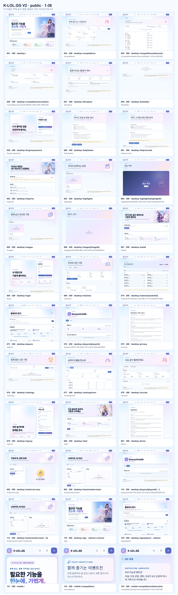
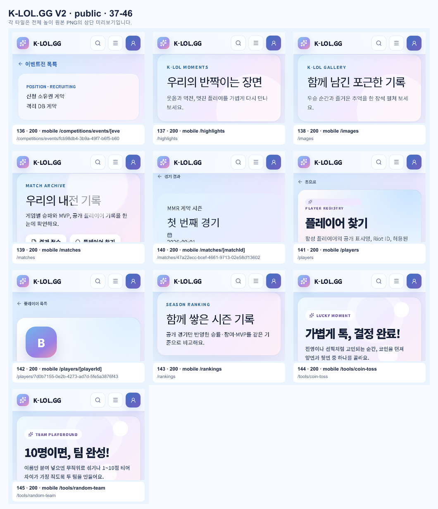
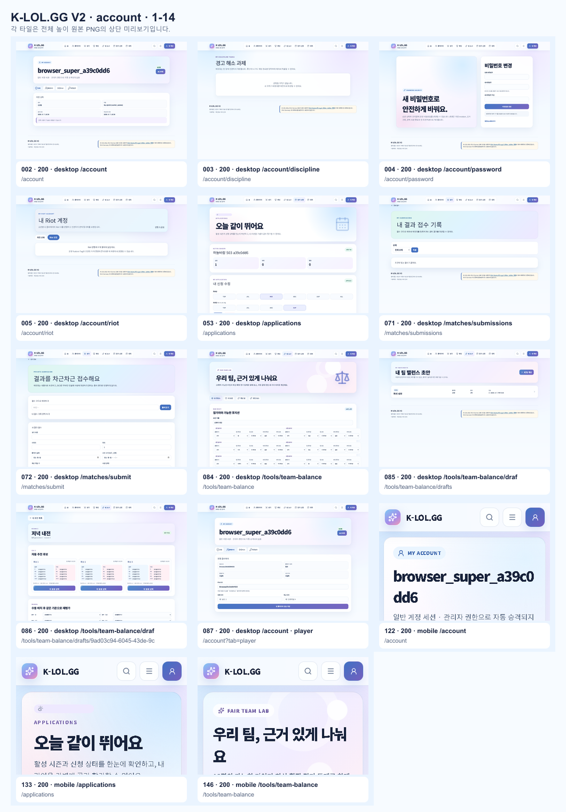
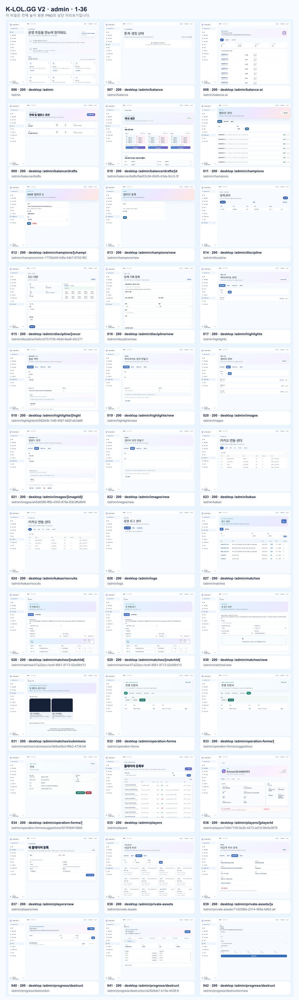
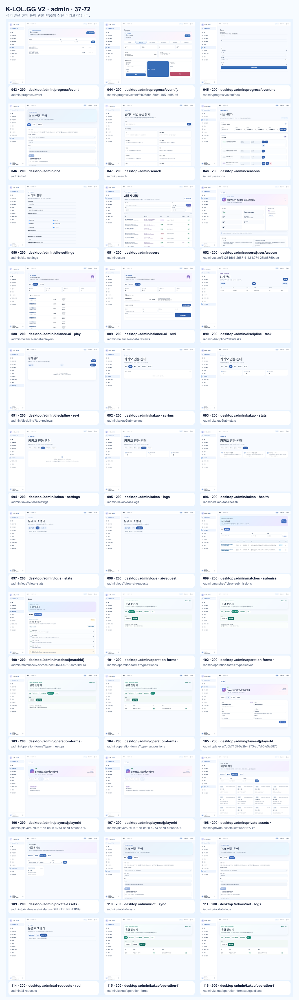
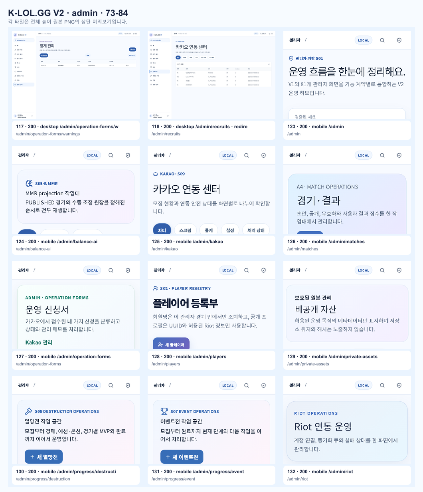
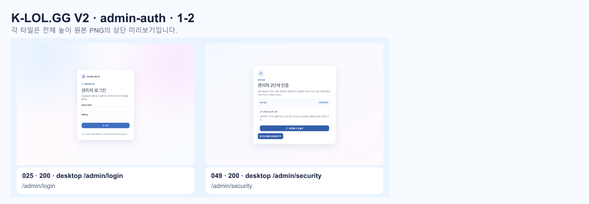

# K-LOL.GG V2 전체 페이지 화면 검수

- 캡처 시각: 2026-09-07T09:38:19.035Z
- 기준 주소: http://127.0.0.1:64067
- 전체 화면: 146개
- 자동 감지 문제: 0개

## 한눈에 보기

### public 1

### public 2

### account 1

### admin 1

### admin 2

### admin 3

### admin-auth 1

## 원본 전체 높이 PNG

| 번호 | 그룹 | 요청 경로 | 최종 상태 | 크기 | 자동 점검 | 원본 |
| ---: | --- | --- | ---: | --- | --- | --- |
| 1 | public | `/` | 200 | 1440×2383 | 통과 | [PNG](./001-desktop.png) |
| 2 | account | `/account` | 200 | 1440×1000 | 통과 | [PNG](./002-desktop-account.png) |
| 3 | account | `/account/discipline` | 200 | 1440×1000 | 통과 | [PNG](./003-desktop-account-discipline.png) |
| 4 | account | `/account/password` | 200 | 1440×1000 | 통과 | [PNG](./004-desktop-account-password.png) |
| 5 | account | `/account/riot` | 200 | 1440×1000 | 통과 | [PNG](./005-desktop-account-riot.png) |
| 6 | admin | `/admin` | 200 | 1440×1320 | 통과 | [PNG](./006-desktop-admin.png) |
| 7 | admin | `/admin/balance` | 200 | 1440×1000 | 통과 | [PNG](./007-desktop-admin-balance.png) |
| 8 | admin | `/admin/balance-ai` | 200 | 1440×1571 | 통과 | [PNG](./008-desktop-admin-balance-ai.png) |
| 9 | admin | `/admin/balance/drafts` | 200 | 1440×1000 | 통과 | [PNG](./009-desktop-admin-balance-drafts.png) |
| 10 | admin | `/admin/balance/drafts/9ad03c94-6045-43de-9cc3-3f6ffb33b7f3` | 200 | 1440×1432 | 통과 | [PNG](./010-desktop-admin-balance-drafts-draftId.png) |
| 11 | admin | `/admin/champions` | 200 | 1440×2197 | 통과 | [PNG](./011-desktop-admin-champions.png) |
| 12 | admin | `/admin/champions/mmr-17792e59-0dfa-4db7-8702-f8342b117cac/edit` | 200 | 1440×1000 | 통과 | [PNG](./012-desktop-admin-champions-championId-edit.png) |
| 13 | admin | `/admin/champions/new` | 200 | 1440×1000 | 통과 | [PNG](./013-desktop-admin-champions-new.png) |
| 14 | admin | `/admin/discipline` | 200 | 1440×1000 | 통과 | [PNG](./014-desktop-admin-discipline.png) |
| 15 | admin | `/admin/discipline/0a5cc070-f7d5-49dd-9ee8-40c2714c14aa` | 200 | 1440×1040 | 통과 | [PNG](./015-desktop-admin-discipline-recordId.png) |
| 16 | admin | `/admin/discipline/new` | 200 | 1440×1213 | 통과 | [PNG](./016-desktop-admin-discipline-new.png) |
| 17 | admin | `/admin/highlights` | 200 | 1440×1000 | 통과 | [PNG](./017-desktop-admin-highlights.png) |
| 18 | admin | `/admin/highlights/e5562b0b-7ef9-4067-b62f-eb3a66ad416d/edit` | 200 | 1440×1134 | 통과 | [PNG](./018-desktop-admin-highlights-highlightId-edit.png) |
| 19 | admin | `/admin/highlights/new` | 200 | 1440×1000 | 통과 | [PNG](./019-desktop-admin-highlights-new.png) |
| 20 | admin | `/admin/images` | 200 | 1440×1000 | 통과 | [PNG](./020-desktop-admin-images.png) |
| 21 | admin | `/admin/images/a45d0586-ff6b-4350-878e-83b3fbd849c2/edit` | 200 | 1440×1045 | 통과 | [PNG](./021-desktop-admin-images-imageId-edit.png) |
| 22 | admin | `/admin/images/new` | 200 | 1440×1000 | 통과 | [PNG](./022-desktop-admin-images-new.png) |
| 23 | admin | `/admin/kakao` | 200 | 1440×1000 | 통과 | [PNG](./023-desktop-admin-kakao.png) |
| 24 | admin | `/admin/kakao/recruits` | 200 | 1440×1000 | 통과 | [PNG](./024-desktop-admin-kakao-recruits.png) |
| 25 | admin-auth | `/admin/login` | 200 | 1440×1000 | 통과 | [PNG](./025-desktop-admin-login.png) |
| 26 | admin | `/admin/logs` | 200 | 1440×1000 | 통과 | [PNG](./026-desktop-admin-logs.png) |
| 27 | admin | `/admin/matches` | 200 | 1440×1000 | 통과 | [PNG](./027-desktop-admin-matches.png) |
| 28 | admin | `/admin/matches/47a22ecc-bcef-4661-9713-02e58cf13602` | 200 | 1440×1713 | 통과 | [PNG](./028-desktop-admin-matches-matchId.png) |
| 29 | admin | `/admin/matches/47a22ecc-bcef-4661-9713-02e58cf13602/edit` | 200 | 1440×1713 | 통과 | [PNG](./029-desktop-admin-matches-matchId-edit.png) |
| 30 | admin | `/admin/matches/new` | 200 | 1440×2383 | 통과 | [PNG](./030-desktop-admin-matches-new.png) |
| 31 | admin | `/admin/matches/submissions/4b9ce5bd-99b2-4728-b652-d3f122df8793` | 200 | 1440×2866 | 통과 | [PNG](./031-desktop-admin-matches-submissions-submissionId.png) |
| 32 | admin | `/admin/operation-forms` | 200 | 1440×1000 | 통과 | [PNG](./032-desktop-admin-operation-forms.png) |
| 33 | admin | `/admin/operation-forms/suggestions` | 200 | 1440×1000 | 통과 | [PNG](./033-desktop-admin-operation-forms-formType.png) |
| 34 | admin | `/admin/operation-forms/suggestions/5076564f-08b6-44bd-9f03-c6e320f05e58` | 200 | 1440×1000 | 통과 | [PNG](./034-desktop-admin-operation-forms-formType-id.png) |
| 35 | admin | `/admin/players` | 200 | 1440×1993 | 통과 | [PNG](./035-desktop-admin-players.png) |
| 36 | admin | `/admin/players/7d0b7155-0e2b-4273-ad7d-5fe5a3876f43` | 200 | 1440×1000 | 통과 | [PNG](./036-desktop-admin-players-playerId.png) |
| 37 | admin | `/admin/players/new` | 200 | 1440×1000 | 통과 | [PNG](./037-desktop-admin-players-new.png) |
| 38 | admin | `/admin/private-assets` | 200 | 1440×1191 | 통과 | [PNG](./038-desktop-admin-private-assets.png) |
| 39 | admin | `/admin/private-assets/71d259bb-2314-469a-b863-a4f0a7b57bc5` | 200 | 1440×1000 | 통과 | [PNG](./039-desktop-admin-private-assets-assetId.png) |
| 40 | admin | `/admin/progress/destruction` | 200 | 1440×1000 | 통과 | [PNG](./040-desktop-admin-progress-destruction.png) |
| 41 | admin | `/admin/progress/destruction/a25b9de7-b15e-4439-8f29-432901b32367` | 200 | 1440×1000 | 통과 | [PNG](./041-desktop-admin-progress-destruction-tournamentId.png) |
| 42 | admin | `/admin/progress/destruction/new` | 200 | 1440×1000 | 통과 | [PNG](./042-desktop-admin-progress-destruction-new.png) |
| 43 | admin | `/admin/progress/event` | 200 | 1440×1000 | 통과 | [PNG](./043-desktop-admin-progress-event.png) |
| 44 | admin | `/admin/progress/event/fcb98db4-3b9a-49f7-b6f5-b60c9c9f5fe6` | 200 | 1440×1000 | 통과 | [PNG](./044-desktop-admin-progress-event-eventId.png) |
| 45 | admin | `/admin/progress/event/new` | 200 | 1440×1000 | 통과 | [PNG](./045-desktop-admin-progress-event-new.png) |
| 46 | admin | `/admin/riot` | 200 | 1440×1298 | 통과 | [PNG](./046-desktop-admin-riot.png) |
| 47 | admin | `/admin/search` | 200 | 1440×1082 | 통과 | [PNG](./047-desktop-admin-search.png) |
| 48 | admin | `/admin/seasons` | 200 | 1440×5074 | 통과 | [PNG](./048-desktop-admin-seasons.png) |
| 49 | admin-auth | `/admin/security` | 200 | 1440×1000 | 통과 | [PNG](./049-desktop-admin-security.png) |
| 50 | admin | `/admin/site-settings` | 200 | 1440×1158 | 통과 | [PNG](./050-desktop-admin-site-settings.png) |
| 51 | admin | `/admin/users` | 200 | 1440×2071 | 통과 | [PNG](./051-desktop-admin-users.png) |
| 52 | admin | `/admin/users/7c261db1-2d67-4112-8074-28b08769aac8` | 200 | 1440×2249 | 통과 | [PNG](./052-desktop-admin-users-userAccountId.png) |
| 53 | account | `/applications` | 200 | 1440×1716 | 통과 | [PNG](./053-desktop-applications.png) |
| 54 | public | `/competitions` | 200 | 1440×1000 | 통과 | [PNG](./054-desktop-competitions.png) |
| 55 | public | `/competitions/destruction/a25b9de7-b15e-4439-8f29-432901b32367` | 200 | 1440×2095 | 통과 | [PNG](./055-desktop-competitions-destruction-tournamentId.png) |
| 56 | public | `/competitions/events/fcb98db4-3b9a-49f7-b6f5-b60c9c9f5fe6` | 200 | 1440×1000 | 통과 | [PNG](./056-desktop-competitions-events-eventId.png) |
| 57 | public | `/discipline` | 200 | 1440×1000 | 통과 | [PNG](./057-desktop-discipline.png) |
| 58 | public | `/forbidden` | 200 | 1440×1000 | 통과 | [PNG](./058-desktop-forbidden.png) |
| 59 | public | `/forgot-password` | 200 | 1440×1000 | 통과 | [PNG](./059-desktop-forgot-password.png) |
| 60 | public | `/help/kakao` | 200 | 1440×1096 | 통과 | [PNG](./060-desktop-help-kakao.png) |
| 61 | public | `/help/recruits` | 200 | 1440×1059 | 통과 | [PNG](./061-desktop-help-recruits.png) |
| 62 | public | `/help/riot` | 200 | 1440×1687 | 통과 | [PNG](./062-desktop-help-riot.png) |
| 63 | public | `/highlights` | 200 | 1440×1000 | 통과 | [PNG](./063-desktop-highlights.png) |
| 64 | public | `/highlights/e5562b0b-7ef9-4067-b62f-eb3a66ad416d` | 200 | 1440×1253 | 통과 | [PNG](./064-desktop-highlights-highlightId.png) |
| 65 | public | `/images` | 200 | 1440×1000 | 통과 | [PNG](./065-desktop-images.png) |
| 66 | public | `/images/a45d0586-ff6b-4350-878e-83b3fbd849c2` | 200 | 1440×1236 | 통과 | [PNG](./066-desktop-images-imageId.png) |
| 67 | public | `/install` | 200 | 1440×1385 | 통과 | [PNG](./067-desktop-install.png) |
| 68 | public | `/login` | 200 | 1440×1042 | 통과 | [PNG](./068-desktop-login.png) |
| 69 | public | `/matches` | 200 | 1440×1179 | 통과 | [PNG](./069-desktop-matches.png) |
| 70 | public | `/matches/47a22ecc-bcef-4661-9713-02e58cf13602` | 200 | 1440×1101 | 통과 | [PNG](./070-desktop-matches-matchId.png) |
| 71 | account | `/matches/submissions` | 200 | 1440×1000 | 통과 | [PNG](./071-desktop-matches-submissions.png) |
| 72 | account | `/matches/submit` | 200 | 1440×1418 | 통과 | [PNG](./072-desktop-matches-submit.png) |
| 73 | public | `/players` | 200 | 1440×2586 | 통과 | [PNG](./073-desktop-players.png) |
| 74 | public | `/players/7d0b7155-0e2b-4273-ad7d-5fe5a3876f43` | 200 | 1440×1176 | 통과 | [PNG](./074-desktop-players-playerId.png) |
| 75 | public | `/privacy` | 200 | 1440×1480 | 통과 | [PNG](./075-desktop-privacy.png) |
| 76 | public | `/rankings` | 200 | 1440×1000 | 통과 | [PNG](./076-desktop-rankings.png) |
| 77 | public | `/rankings/mmr` | 200 | 1440×1636 | 통과 | [PNG](./077-desktop-rankings-mmr.png) |
| 78 | public | `/recruits` | 200 | 1440×1041 | 통과 | [PNG](./078-desktop-recruits.png) |
| 79 | public | `/signup` | 200 | 1440×1286 | 통과 | [PNG](./079-desktop-signup.png) |
| 80 | public | `/start` | 200 | 1440×1022 | 통과 | [PNG](./080-desktop-start.png) |
| 81 | public | `/terms` | 200 | 1440×1340 | 통과 | [PNG](./081-desktop-terms.png) |
| 82 | public | `/tools/coin-toss` | 200 | 1440×1131 | 통과 | [PNG](./082-desktop-tools-coin-toss.png) |
| 83 | public | `/tools/random-team` | 200 | 1440×1237 | 통과 | [PNG](./083-desktop-tools-random-team.png) |
| 84 | account | `/tools/team-balance` | 200 | 1440×1546 | 통과 | [PNG](./084-desktop-tools-team-balance.png) |
| 85 | account | `/tools/team-balance/drafts` | 200 | 1440×1000 | 통과 | [PNG](./085-desktop-tools-team-balance-drafts.png) |
| 86 | account | `/tools/team-balance/drafts/9ad03c94-6045-43de-9cc3-3f6ffb33b7f3` | 200 | 1440×1599 | 통과 | [PNG](./086-desktop-tools-team-balance-drafts-draftId.png) |
| 87 | account | `/account?tab=player` | 200 | 1440×1149 | 통과 | [PNG](./087-desktop-account-player.png) |
| 88 | admin | `/admin/balance-ai?tab=players` | 200 | 1440×1571 | 통과 | [PNG](./088-desktop-admin-balance-ai-players.png) |
| 89 | admin | `/admin/balance-ai?tab=reviews` | 200 | 1440×1000 | 통과 | [PNG](./089-desktop-admin-balance-ai-reviews.png) |
| 90 | admin | `/admin/discipline?tab=tasks` | 200 | 1440×1000 | 통과 | [PNG](./090-desktop-admin-discipline-tasks.png) |
| 91 | admin | `/admin/discipline?tab=reviews` | 200 | 1440×1000 | 통과 | [PNG](./091-desktop-admin-discipline-reviews.png) |
| 92 | admin | `/admin/kakao?tab=scrims` | 200 | 1440×1000 | 통과 | [PNG](./092-desktop-admin-kakao-scrims.png) |
| 93 | admin | `/admin/kakao?tab=stats` | 200 | 1440×1000 | 통과 | [PNG](./093-desktop-admin-kakao-stats.png) |
| 94 | admin | `/admin/kakao?tab=settings` | 200 | 1440×1000 | 통과 | [PNG](./094-desktop-admin-kakao-settings.png) |
| 95 | admin | `/admin/kakao?tab=logs` | 200 | 1440×1000 | 통과 | [PNG](./095-desktop-admin-kakao-logs.png) |
| 96 | admin | `/admin/kakao?tab=health` | 200 | 1440×1000 | 통과 | [PNG](./096-desktop-admin-kakao-health.png) |
| 97 | admin | `/admin/logs?view=stats` | 200 | 1440×1000 | 통과 | [PNG](./097-desktop-admin-logs-stats.png) |
| 98 | admin | `/admin/logs?view=ai-requests` | 200 | 1440×1000 | 통과 | [PNG](./098-desktop-admin-logs-ai-requests.png) |
| 99 | admin | `/admin/matches?view=submissions` | 200 | 1440×1000 | 통과 | [PNG](./099-desktop-admin-matches-submissions.png) |
| 100 | admin | `/admin/matches/47a22ecc-bcef-4661-9713-02e58cf13602?tab=ai-review` | 200 | 1440×1179 | 통과 | [PNG](./100-desktop-admin-matches-matchId-ai-review.png) |
| 101 | admin | `/admin/operation-forms?type=friends` | 200 | 1440×1000 | 통과 | [PNG](./101-desktop-admin-operation-forms-friends.png) |
| 102 | admin | `/admin/operation-forms?type=leaves` | 200 | 1440×1000 | 통과 | [PNG](./102-desktop-admin-operation-forms-leaves.png) |
| 103 | admin | `/admin/operation-forms?type=meetups` | 200 | 1440×1000 | 통과 | [PNG](./103-desktop-admin-operation-forms-meetups.png) |
| 104 | admin | `/admin/operation-forms?type=suggestions` | 200 | 1440×1000 | 통과 | [PNG](./104-desktop-admin-operation-forms-suggestions.png) |
| 105 | admin | `/admin/players/7d0b7155-0e2b-4273-ad7d-5fe5a3876f43?mode=edit` | 200 | 1440×1000 | 통과 | [PNG](./105-desktop-admin-players-playerId-edit.png) |
| 106 | admin | `/admin/players/7d0b7155-0e2b-4273-ad7d-5fe5a3876f43?tab=balance` | 200 | 1440×1000 | 통과 | [PNG](./106-desktop-admin-players-playerId-balance.png) |
| 107 | admin | `/admin/players/7d0b7155-0e2b-4273-ad7d-5fe5a3876f43?tab=riot` | 200 | 1440×1000 | 통과 | [PNG](./107-desktop-admin-players-playerId-riot.png) |
| 108 | admin | `/admin/private-assets?status=READY` | 200 | 1440×1191 | 통과 | [PNG](./108-desktop-admin-private-assets-ready.png) |
| 109 | admin | `/admin/private-assets?status=DELETE_PENDING` | 200 | 1440×1000 | 통과 | [PNG](./109-desktop-admin-private-assets-cleanup.png) |
| 110 | admin | `/admin/riot?tab=sync` | 200 | 1440×1298 | 통과 | [PNG](./110-desktop-admin-riot-sync.png) |
| 111 | admin | `/admin/riot?tab=logs` | 200 | 1440×1298 | 통과 | [PNG](./111-desktop-admin-riot-logs.png) |
| 112 | public | `/players/7d0b7155-0e2b-4273-ad7d-5fe5a3876f43?tab=riot` | 200 | 1440×1000 | 통과 | [PNG](./112-desktop-players-playerId-riot.png) |
| 113 | public | `/tools/random-team?mode=tier` | 200 | 1440×1237 | 통과 | [PNG](./113-desktop-tools-random-team-tier.png) |
| 114 | admin | `/admin/ai-requests` | 200 | 1440×1000 | 통과 | [PNG](./114-desktop-admin-ai-requests-redirect-contract.png) |
| 115 | admin | `/admin/kakao/operation-forms` | 200 | 1440×1000 | 통과 | [PNG](./115-desktop-admin-kakao-operation-forms-redirect-contract.png) |
| 116 | admin | `/admin/kakao/operation-forms/suggestions` | 200 | 1440×1000 | 통과 | [PNG](./116-desktop-admin-kakao-operation-forms-formType-redirect-contract.png) |
| 117 | admin | `/admin/operation-forms/warnings` | 200 | 1440×1000 | 통과 | [PNG](./117-desktop-admin-operation-forms-warnings-redirect-contract.png) |
| 118 | admin | `/admin/recruits` | 200 | 1440×1000 | 통과 | [PNG](./118-desktop-admin-recruits-redirect-contract.png) |
| 119 | public | `/app` | 200 | 1440×2383 | 통과 | [PNG](./119-desktop-app-redirect-contract.png) |
| 120 | public | `/app/players` | 200 | 1440×2586 | 통과 | [PNG](./120-desktop-app-players-redirect-contract.png) |
| 121 | public | `/` | 200 | 390×3987 | 통과 | [PNG](./121-mobile.png) |
| 122 | account | `/account` | 200 | 390×1309 | 통과 | [PNG](./122-mobile-account.png) |
| 123 | admin | `/admin` | 200 | 390×3023 | 통과 | [PNG](./123-mobile-admin.png) |
| 124 | admin | `/admin/balance-ai` | 200 | 390×3374 | 통과 | [PNG](./124-mobile-admin-balance-ai.png) |
| 125 | admin | `/admin/kakao` | 200 | 390×932 | 통과 | [PNG](./125-mobile-admin-kakao.png) |
| 126 | admin | `/admin/matches` | 200 | 390×1431 | 통과 | [PNG](./126-mobile-admin-matches.png) |
| 127 | admin | `/admin/operation-forms` | 200 | 390×975 | 통과 | [PNG](./127-mobile-admin-operation-forms.png) |
| 128 | admin | `/admin/players` | 200 | 390×6979 | 통과 | [PNG](./128-mobile-admin-players.png) |
| 129 | admin | `/admin/private-assets` | 200 | 390×3218 | 통과 | [PNG](./129-mobile-admin-private-assets.png) |
| 130 | admin | `/admin/progress/destruction` | 200 | 390×1036 | 통과 | [PNG](./130-mobile-admin-progress-destruction.png) |
| 131 | admin | `/admin/progress/event` | 200 | 390×1189 | 통과 | [PNG](./131-mobile-admin-progress-event.png) |
| 132 | admin | `/admin/riot` | 200 | 390×1486 | 통과 | [PNG](./132-mobile-admin-riot.png) |
| 133 | account | `/applications` | 200 | 390×2335 | 통과 | [PNG](./133-mobile-applications.png) |
| 134 | public | `/competitions` | 200 | 390×1580 | 통과 | [PNG](./134-mobile-competitions.png) |
| 135 | public | `/competitions/destruction/a25b9de7-b15e-4439-8f29-432901b32367` | 200 | 390×3246 | 통과 | [PNG](./135-mobile-competitions-destruction-tournamentId.png) |
| 136 | public | `/competitions/events/fcb98db4-3b9a-49f7-b6f5-b60c9c9f5fe6` | 200 | 390×1277 | 통과 | [PNG](./136-mobile-competitions-events-eventId.png) |
| 137 | public | `/highlights` | 200 | 390×1090 | 통과 | [PNG](./137-mobile-highlights.png) |
| 138 | public | `/images` | 200 | 390×1055 | 통과 | [PNG](./138-mobile-images.png) |
| 139 | public | `/matches` | 200 | 390×1974 | 통과 | [PNG](./139-mobile-matches.png) |
| 140 | public | `/matches/47a22ecc-bcef-4661-9713-02e58cf13602` | 200 | 390×1791 | 통과 | [PNG](./140-mobile-matches-matchId.png) |
| 141 | public | `/players` | 200 | 390×5544 | 통과 | [PNG](./141-mobile-players.png) |
| 142 | public | `/players/7d0b7155-0e2b-4273-ad7d-5fe5a3876f43` | 200 | 390×1646 | 통과 | [PNG](./142-mobile-players-playerId.png) |
| 143 | public | `/rankings` | 200 | 390×1134 | 통과 | [PNG](./143-mobile-rankings.png) |
| 144 | public | `/tools/coin-toss` | 200 | 390×1439 | 통과 | [PNG](./144-mobile-tools-coin-toss.png) |
| 145 | public | `/tools/random-team` | 200 | 390×1856 | 통과 | [PNG](./145-mobile-tools-random-team.png) |
| 146 | account | `/tools/team-balance` | 200 | 390×3755 | 통과 | [PNG](./146-mobile-tools-team-balance.png) |
