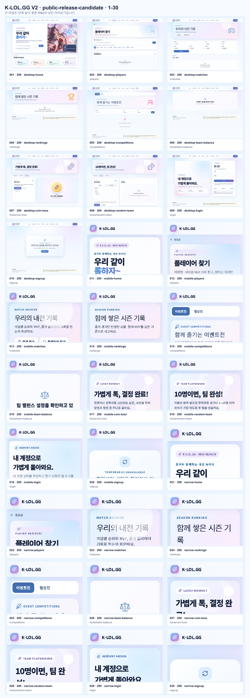

# K-LOL.GG V2 전체 페이지 화면 검수

- 캡처 시각: 2026-09-11T10:12:36.655Z
- 기준 주소: http://127.0.0.1:3000
- 전체 화면: 30개
- 자동 감지 문제: 3개

## 한눈에 보기

### public-release-candidate 1

## 원본 전체 높이 PNG

| 번호 | 그룹 | 요청 경로 | 최종 상태 | 크기 | 자동 점검 | 원본 |
| ---: | --- | --- | ---: | --- | --- | --- |
| 1 | public-release-candidate | `/` | 200 | 1440×2121 | 통과 | [PNG](./001-desktop-home.png) |
| 2 | public-release-candidate | `/players` | 200 | 1440×1187 | 통과 | [PNG](./002-desktop-players.png) |
| 3 | public-release-candidate | `/matches` | 200 | 1440×1138 | 통과 | [PNG](./003-desktop-matches.png) |
| 4 | public-release-candidate | `/rankings` | 200 | 1440×1000 | 통과 | [PNG](./004-desktop-rankings.png) |
| 5 | public-release-candidate | `/competitions` | 200 | 1440×1033 | VISIBLE_RUNTIME_FAILURE | [PNG](./005-desktop-competitions.png) |
| 6 | public-release-candidate | `/tools/team-balance` | 200 | 1440×1000 | 통과 | [PNG](./006-desktop-team-balance.png) |
| 7 | public-release-candidate | `/tools/coin-toss` | 200 | 1440×1131 | 통과 | [PNG](./007-desktop-coin-toss.png) |
| 8 | public-release-candidate | `/tools/random-team` | 200 | 1440×1237 | 통과 | [PNG](./008-desktop-random-team.png) |
| 9 | public-release-candidate | `/login` | 200 | 1440×1030 | 통과 | [PNG](./009-desktop-login.png) |
| 10 | public-release-candidate | `/signup` | 200 | 1440×1006 | 통과 | [PNG](./010-desktop-signup.png) |
| 11 | public-release-candidate | `/` | 200 | 390×3165 | 통과 | [PNG](./011-mobile-home.png) |
| 12 | public-release-candidate | `/players` | 200 | 390×1416 | 통과 | [PNG](./012-mobile-players.png) |
| 13 | public-release-candidate | `/matches` | 200 | 390×1686 | 통과 | [PNG](./013-mobile-matches.png) |
| 14 | public-release-candidate | `/rankings` | 200 | 390×932 | 통과 | [PNG](./014-mobile-rankings.png) |
| 15 | public-release-candidate | `/competitions` | 200 | 390×1386 | VISIBLE_RUNTIME_FAILURE | [PNG](./015-mobile-competitions.png) |
| 16 | public-release-candidate | `/tools/team-balance` | 200 | 390×932 | 통과 | [PNG](./016-mobile-team-balance.png) |
| 17 | public-release-candidate | `/tools/coin-toss` | 200 | 390×1492 | 통과 | [PNG](./017-mobile-coin-toss.png) |
| 18 | public-release-candidate | `/tools/random-team` | 200 | 390×1909 | 통과 | [PNG](./018-mobile-random-team.png) |
| 19 | public-release-candidate | `/login` | 200 | 390×1700 | 통과 | [PNG](./019-mobile-login.png) |
| 20 | public-release-candidate | `/signup` | 200 | 390×949 | 통과 | [PNG](./020-mobile-signup.png) |
| 21 | public-release-candidate | `/` | 200 | 320×3191 | 통과 | [PNG](./021-narrow-home.png) |
| 22 | public-release-candidate | `/players` | 200 | 320×1434 | 통과 | [PNG](./022-narrow-players.png) |
| 23 | public-release-candidate | `/matches` | 200 | 320×1758 | 통과 | [PNG](./023-narrow-matches.png) |
| 24 | public-release-candidate | `/rankings` | 200 | 320×888 | 통과 | [PNG](./024-narrow-rankings.png) |
| 25 | public-release-candidate | `/competitions` | 200 | 320×1447 | VISIBLE_RUNTIME_FAILURE | [PNG](./025-narrow-competitions.png) |
| 26 | public-release-candidate | `/tools/team-balance` | 200 | 320×888 | 통과 | [PNG](./026-narrow-team-balance.png) |
| 27 | public-release-candidate | `/tools/coin-toss` | 200 | 320×1637 | 통과 | [PNG](./027-narrow-coin-toss.png) |
| 28 | public-release-candidate | `/tools/random-team` | 200 | 320×2036 | 통과 | [PNG](./028-narrow-random-team.png) |
| 29 | public-release-candidate | `/login` | 200 | 320×1718 | 통과 | [PNG](./029-narrow-login.png) |
| 30 | public-release-candidate | `/signup` | 200 | 320×967 | 통과 | [PNG](./030-narrow-signup.png) |
