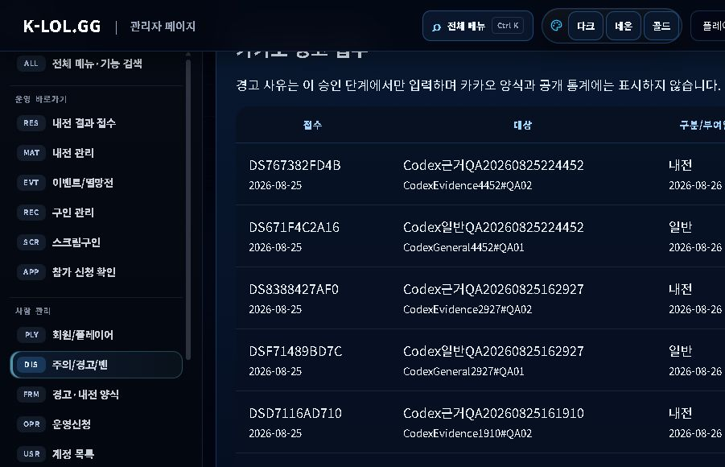
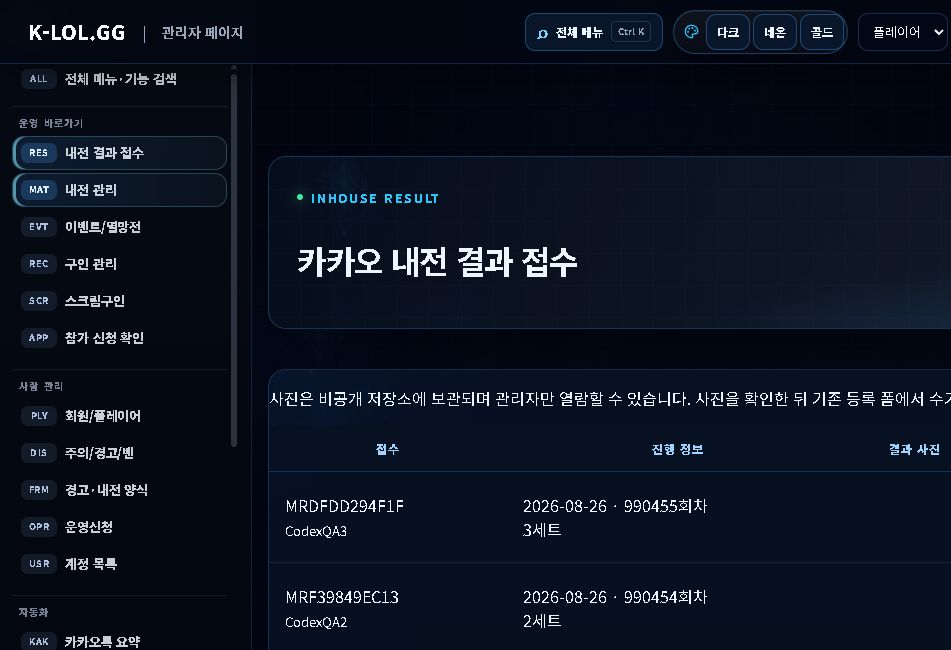
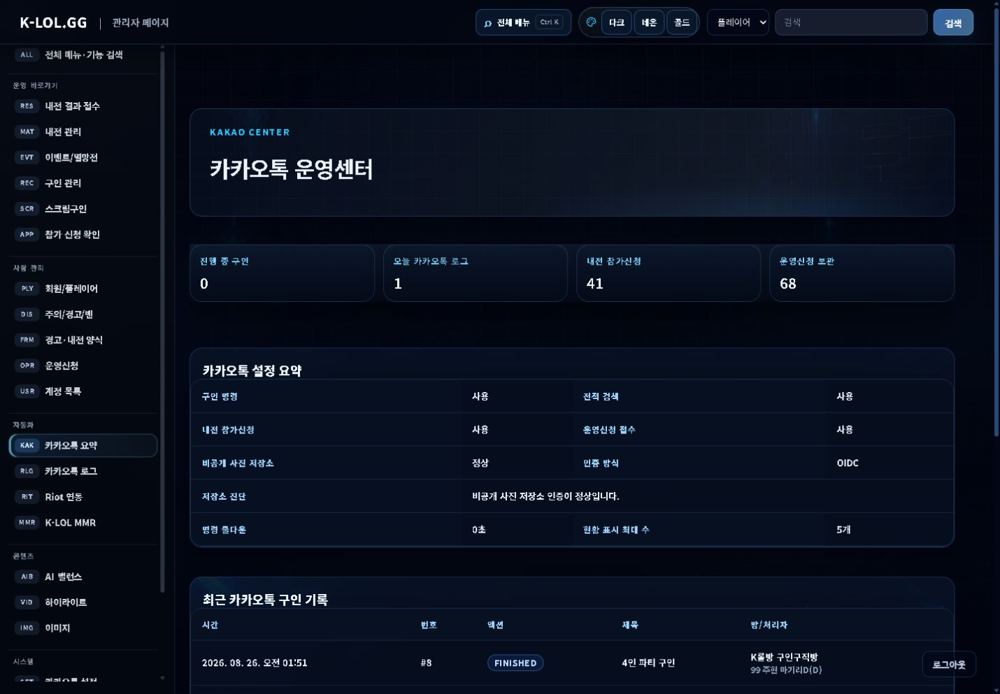
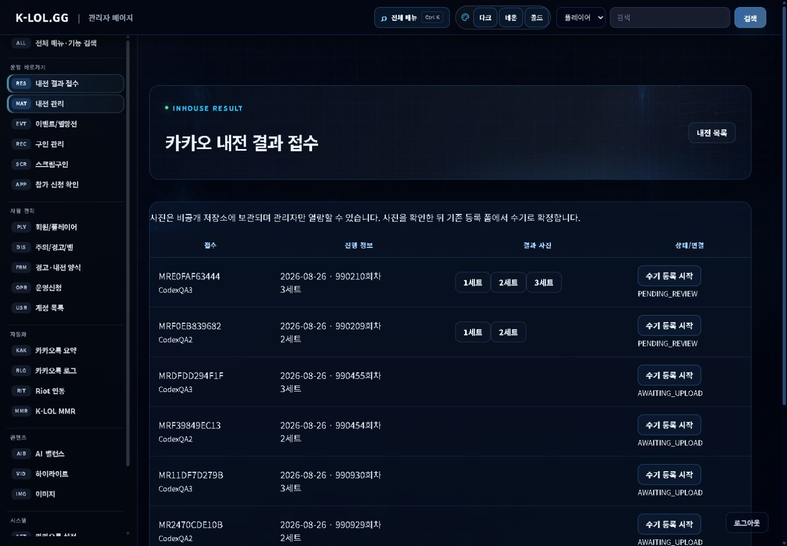
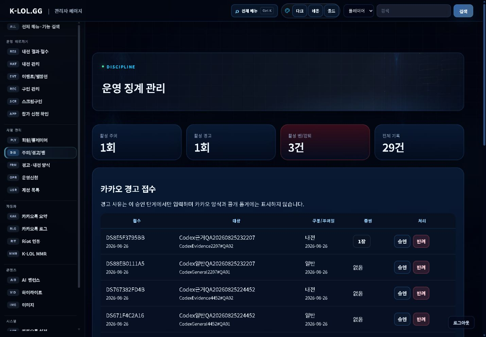

# K-LOL.GG 경고·내전 데이터 검증 보고서

검증 시각: 2026-08-26 KST  
대상: 운영 배포 `https://k-lol-gg.vercel.app`  
방 이름: `K 롤방 K롤방 공유& 문의 &건의 오픈톡방`

## 결론

- 마우스·키보드 입력 없이 운영 API와 데이터베이스 조회만으로 경고·내전 접수를 검증할 수 있다.
- 생성된 경고 2건과 내전 결과 접수 2건은 데이터베이스에 저장됐고 관리자 사이트에도 동일한 접수번호로 표시됐다.
- 양식 호출, 접수, 상태 조회, 중복 차단, 사진 수 경계 검사는 정상이다.
- Vercel Private Blob 저장소를 생성·연결한 뒤 유효한 PNG의 실제 저장이 경고와 내전 모두 정상 처리된다.
- 사진 저장 실패 후 사진 수가 증가하거나 불완전한 이미지 레코드가 남지는 않았다.
- 경고 접수의 생성일이 UTC 기준 `2026-08-25`로 표시되던 원인을 확인해 KST 날짜 변환으로 수정했고 운영 화면에서 `2026-08-26` 표시를 재확인했다.

## 원인 및 수정

- 날짜 원인: 관리자 경고 목록이 `toISOString().slice(0, 10)`으로 UTC 날짜를 표시했다.
- 날짜 수정: 경고 접수와 강퇴 검토 생성일을 공통 `getKstDateKey`로 변환한다.
- 사진 원인: Vercel 프로젝트의 Storage 목록이 비어 있어 private Blob 저장소와 `BLOB_STORE_ID` 연결이 존재하지 않았다. 운영 업로드는 연결되지 않은 정적 토큰 경로에서 `Access denied`가 발생했다.
- 사진 코드 수정: 저장·조회·삭제가 동일한 인증 선택을 사용하고, `BLOB_STORE_ID`가 있으면 OIDC를 우선한다. `/admin/kakao`에서 실제 Blob 목록 조회를 통한 연결 진단 결과와 인증 방식을 표시한다.
- 외부 설정 완료: `k-lol-gg-blob` private store를 서울 `ICN1`에 생성하고 `k-lol-gg` Production·Preview에 `BLOB_STORE_ID`, `BLOB_WEBHOOK_PUBLIC_KEY`를 연결했다. 정적 read/write 토큰은 만들지 않았다.

## API 자동 검증 결과

| 항목 | 결과 |
|---|---|
| 경고 양식 호출 | 통과 |
| 일반 경고 근거사진 0장 접수 | 통과 |
| 동일 경고 양식 중복 차단 | 통과 |
| 경고 접수 상태 조회 | 통과 |
| 내전 경고 근거사진 세션 생성 | 통과 |
| 잘못된 이미지 형식 차단 | 통과 |
| 경고 근거사진 0~3장 경계 | 통과 |
| 내전등록 양식 호출 | 통과 |
| 내전 2세트 접수·상태·중복 차단 | 통과 |
| 내전 3세트 접수·상태·중복 차단 | 통과 |
| 일반 경고 차감 목표 10장 | 통과 |

총 15개 자동 확인 항목이 통과했다.

## 생성된 테스트 데이터

| 접수번호 | 종류 | 데이터베이스 상태 | 사진 |
|---|---|---|---|
| `DS671F4C2A16` | 일반 경고, 근거사진 0장 | `PENDING_REVIEW` | 0장 |
| `DS767382FD4B` | 내전 경고, 근거사진 1장 | `AWAITING_UPLOAD` | 0/1장 |
| `MRF39849EC13` | 내전 결과 2세트 | `AWAITING_UPLOAD` | 0/2장 |
| `MRDFDD294F1F` | 내전 결과 3세트 | `AWAITING_UPLOAD` | 0/3장 |

경고 사진 세션은 기대 수량 1장, 내전 사진 세션은 각각 2장과 3장으로 데이터베이스에 생성됐다.

## 사이트 표시 확인

### 경고 접수

관리자 `/admin/discipline` 화면에 `DS767382FD4B`, `DS671F4C2A16`이 최신 접수로 표시됐다.

### 내전 결과 접수

관리자 `/admin/matches/submissions` 화면에 `MRDFDD294F1F` 3세트와 `MRF39849EC13` 2세트가 표시됐다. 두 건 모두 `수기 등록 시작` 링크와 `AWAITING_UPLOAD` 상태를 가진다.

## 수정 전 사진 저장 검증

합성 PNG를 경고 `DS767382FD4B`와 내전 `MRF39849EC13`에 각각 전송했다.

- 응답 본문: `statusCode: 500`
- 사용자 문구: `사진 저장 중 오류가 발생했습니다. 관리자에게 문의해주세요.`
- HTTP 상태가 200인 것은 카카오봇의 Jsoup 오류를 피하기 위해 실제 상태를 JSON의 `statusCode`에 담는 현재 API 설계다.
- 실패 후 경고 사진 수는 0/1장, 내전 사진 수는 0/2장으로 유지됐다.
- 세션은 `ACTIVE`, 접수는 `AWAITING_UPLOAD`로 유지되어 재시도할 수 있다.

## 수정 배포 및 재검증

- 수정 커밋: `a0319cf` (`fix: diagnose private blob uploads and use KST dates`)
- GitHub `main` 푸시: 완료
- Vercel 배포 상태: `success` (`Deployment has completed`)
- Blob 연결 재배포 커밋: `030450f` (`chore: redeploy with private blob connection`)
- Vercel 배포 상태: `success`
- 재검증 실행 ID: `20260825232207`
- 15개 API 자동 검증: 전부 통과
- 경고 `DS8E5F3795BB`: 실제 PNG 1/1장 저장, 세션 `COMPLETE`, 접수 `PENDING_REVIEW`
- 내전 `MRF0EB839682`: 실제 PNG 2/2장 저장, 세션 `COMPLETE`, 접수 `PENDING_REVIEW`
- 내전 `MRE0FAF63444`: 실제 PNG 3/3장 저장, 세션 `COMPLETE`, 접수 `PENDING_REVIEW`
- 6개 자산 메타데이터의 provider는 모두 `VERCEL_BLOB`이며 파일 크기와 용도가 정상 기록됐다.
- `/api/admin/private-assets/1`을 관리자 인증 상태에서 열어 `image/png`, 1280×720 원본 조회를 확인했다.

### 최종 관리자 화면

## 판정

| 범위 | 판정 |
|---|---|
| 카카오 양식·접수 API | 정상 |
| 접수번호와 중복 방지 | 정상 |
| 데이터베이스 저장 | 정상 |
| 관리자 사이트 표시 | 정상 |
| 잘못된 이미지 차단 | 정상 |
| 유효한 이미지의 비공개 저장 | 정상 |
| 실패 시 부분 데이터 방지 | 정상 |
| 경고 접수 생성일 KST 표시 | 운영 확인 완료 |
| 실제 카카오 메신저봇R 사진 이벤트 | 운영 단말 확인 필요 |

## 남은 조치

1. 테스트 경고·내전 접수 건은 관리자가 승인하지 말고 QA 데이터로 구분해 정리한다.
2. 실제 카카오 메신저봇R에서 사진 메시지 분리 수신을 1회 확인한다.
3. 실제 경고 승인 후 일반 10장·내전 15장 차감 인증 완료 흐름을 운영자 입회로 검증한다.
4. 90일 만료 자산의 실제 Blob 삭제 스케줄을 연결한다.
